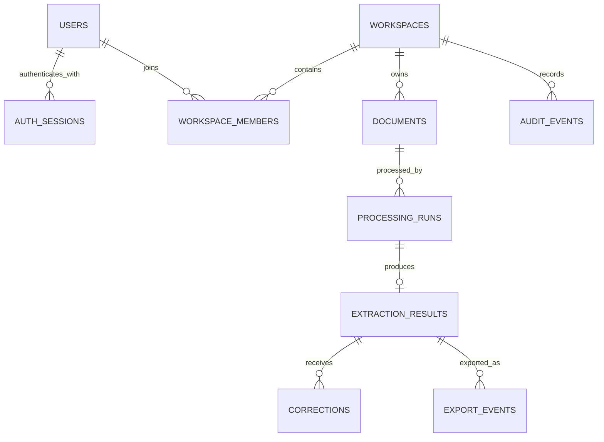
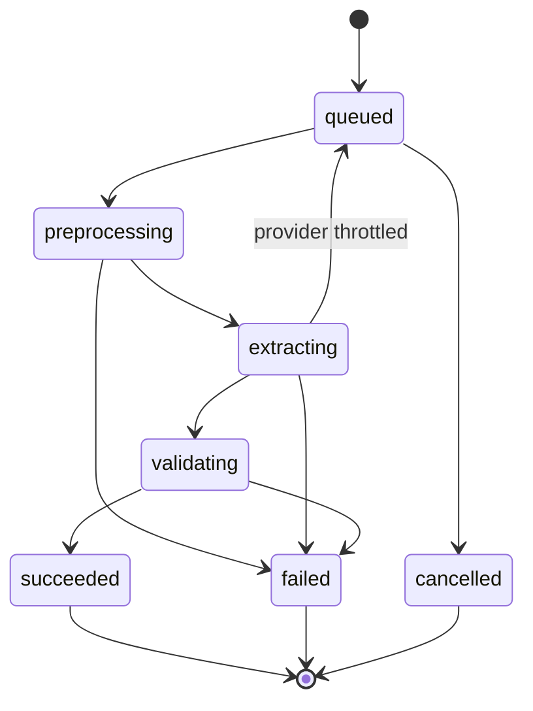
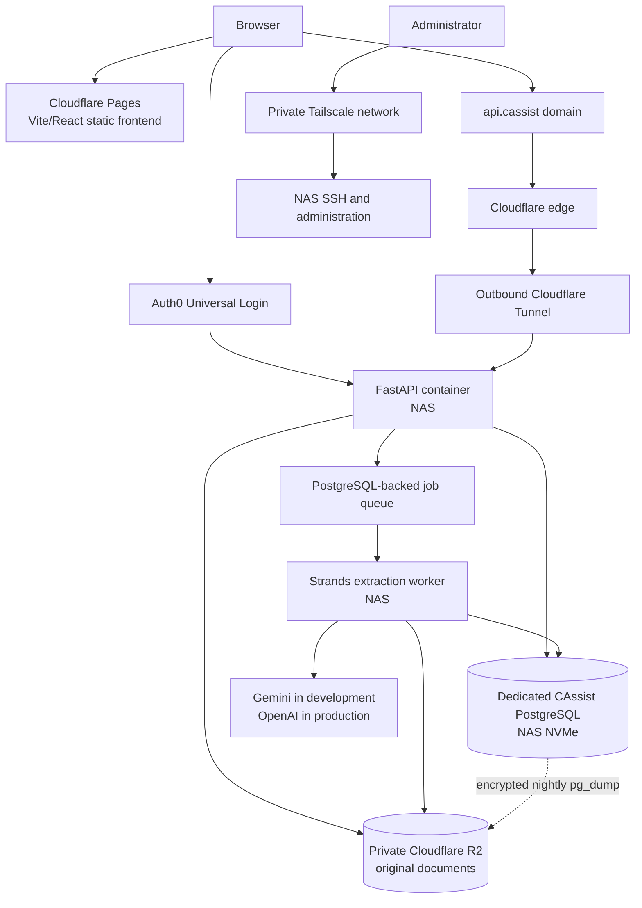

# CAssist: Application Architecture and API Contract

Status: architecture baseline  
API prefix: `/api/v1`  
Frontend: Vite + React + JavaScript + shadcn/ui  
Backend: FastAPI + PostgreSQL + Strands Agents + uv<br>
Object storage: private Cloudflare R2  
Test model: `gemini-3.5-flash-lite`<br>
Production model: `gpt-5.6-luna`

## 1. Locked boundaries

- There are no client, vendor, ledger, inventory, or Tally master tables.
- Original uploads remain in private R2 until the user deletes them.
- Derived page images and other preprocessing files are temporary.
- PostgreSQL stores file hashes, processing history, structured results, corrections, validations, and export events.
- ZIP files and direct Tally integration are outside the MVP.
- Production always uses OpenAI; Gemini selection and dual-model comparison are non-production features.
- Authentication uses Auth0 Universal Login through an Authlib-based OIDC adapter in FastAPI.
- CAssist never stores passwords or sends OIDC tokens to frontend JavaScript.
- Application sessions are opaque, revocable, and stored as hashes in PostgreSQL.
- HTTP access logs never include query strings because callbacks and signed URLs can contain secrets.
- Python versions, the backend project environment, dependency resolution, locking, and command
  execution are managed with Astral `uv`; manual `pip`/`venv` workflows are not used.

## 2. Entity relationships



## 3. PostgreSQL schema

The SQL below is the intended first migration. UUIDs are generated in PostgreSQL so API workers do not need a shared ID generator.

```sql
CREATE EXTENSION IF NOT EXISTS pgcrypto;

CREATE TYPE member_role AS ENUM ('owner', 'admin', 'member');
CREATE TYPE document_status AS ENUM (
    'upload_pending',
    'uploaded',
    'processing',
    'ready',
    'failed'
);
CREATE TYPE run_status AS ENUM (
    'queued',
    'preprocessing',
    'extracting',
    'validating',
    'succeeded',
    'failed',
    'cancelled'
);
CREATE TYPE review_status AS ENUM ('unreviewed', 'in_review', 'approved');
CREATE TYPE model_provider AS ENUM ('openai', 'gemini');
CREATE TYPE export_format AS ENUM ('json', 'csv', 'xlsx', 'tally_json');

CREATE TABLE users (
    id                  uuid PRIMARY KEY DEFAULT gen_random_uuid(),
    external_auth_id    text NOT NULL UNIQUE,
    email               text NOT NULL,
    display_name        text,
    created_at          timestamptz NOT NULL DEFAULT now(),
    last_seen_at        timestamptz
);

CREATE UNIQUE INDEX users_email_lower_idx ON users (lower(email));

CREATE TABLE workspaces (
    id                  uuid PRIMARY KEY DEFAULT gen_random_uuid(),
    name                text NOT NULL,
    created_by_user_id  uuid NOT NULL REFERENCES users(id),
    created_at          timestamptz NOT NULL DEFAULT now()
);

CREATE TABLE workspace_members (
    workspace_id        uuid NOT NULL REFERENCES workspaces(id) ON DELETE CASCADE,
    user_id             uuid NOT NULL REFERENCES users(id) ON DELETE CASCADE,
    role                member_role NOT NULL DEFAULT 'member',
    created_at          timestamptz NOT NULL DEFAULT now(),
    PRIMARY KEY (workspace_id, user_id)
);

CREATE TABLE documents (
    id                      uuid PRIMARY KEY DEFAULT gen_random_uuid(),
    workspace_id            uuid NOT NULL REFERENCES workspaces(id) ON DELETE CASCADE,
    uploaded_by_user_id     uuid NOT NULL REFERENCES users(id),
    original_filename       text NOT NULL,
    mime_type               text NOT NULL,
    byte_size               bigint NOT NULL CHECK (byte_size > 0),
    page_count              integer CHECK (page_count IS NULL OR page_count > 0),
    sha256                  char(64),
    r2_object_key           text,
    status                  document_status NOT NULL DEFAULT 'upload_pending',
    upload_expires_at       timestamptz,
    original_deleted_at     timestamptz,
    original_deleted_by    uuid REFERENCES users(id),
    created_at              timestamptz NOT NULL DEFAULT now(),
    updated_at              timestamptz NOT NULL DEFAULT now(),
    CHECK (
        (original_deleted_at IS NULL)
        OR (r2_object_key IS NULL AND original_deleted_by IS NOT NULL)
    )
);

-- Deduplicate only inside a workspace. Null hashes represent unfinished uploads.
CREATE UNIQUE INDEX documents_workspace_sha256_idx
    ON documents (workspace_id, sha256)
    WHERE sha256 IS NOT NULL;

CREATE INDEX documents_workspace_created_idx
    ON documents (workspace_id, created_at DESC);

CREATE TABLE processing_runs (
    id                      uuid PRIMARY KEY DEFAULT gen_random_uuid(),
    document_id             uuid NOT NULL REFERENCES documents(id) ON DELETE CASCADE,
    requested_by_user_id    uuid NOT NULL REFERENCES users(id),
    provider                model_provider NOT NULL,
    model_id                text NOT NULL,
    prompt_version          text NOT NULL,
    schema_version          text NOT NULL,
    preprocessing_version   text NOT NULL,
    status                  run_status NOT NULL DEFAULT 'queued',
    progress_stage          text NOT NULL DEFAULT 'queued' CHECK (
                                progress_stage IN (
                                    'queued', 'preparing', 'classifying', 'extracting',
                                    'organizing', 'quality_check', 'saving', 'complete', 'failed'
                                )
                            ),
    attempt_count           integer NOT NULL DEFAULT 0 CHECK (attempt_count >= 0),
    input_tokens            integer CHECK (input_tokens IS NULL OR input_tokens >= 0),
    output_tokens           integer CHECK (output_tokens IS NULL OR output_tokens >= 0),
    estimated_cost_usd      numeric(12, 6) CHECK (
                                estimated_cost_usd IS NULL OR estimated_cost_usd >= 0
                            ),
    error_code              text,
    error_message_safe      text,
    worker_id               text,
    lease_expires_at        timestamptz,
    queued_at               timestamptz NOT NULL DEFAULT now(),
    started_at              timestamptz,
    completed_at            timestamptz,
    created_at              timestamptz NOT NULL DEFAULT now()
);

-- A configuration can have many failed attempts, but only one successful cache entry.
CREATE UNIQUE INDEX processing_runs_success_cache_idx
    ON processing_runs (
        document_id,
        provider,
        model_id,
        prompt_version,
        schema_version,
        preprocessing_version
    )
    WHERE status = 'succeeded';

CREATE INDEX processing_runs_queue_idx
    ON processing_runs (queued_at)
    WHERE status = 'queued';

CREATE INDEX processing_runs_reclaim_idx
    ON processing_runs (lease_expires_at)
    WHERE status IN ('preprocessing', 'extracting', 'validating');

CREATE TABLE extraction_results (
    id                      uuid PRIMARY KEY DEFAULT gen_random_uuid(),
    processing_run_id       uuid NOT NULL UNIQUE
                                REFERENCES processing_runs(id) ON DELETE CASCADE,
    document_type           text NOT NULL,
    raw_provider_output     jsonb NOT NULL,
    canonical_data          jsonb NOT NULL,
    presentation_data       jsonb NOT NULL DEFAULT '{"sections":[]}'::jsonb,
    evidence_data           jsonb NOT NULL DEFAULT '[]'::jsonb,
    validation_issues       jsonb NOT NULL DEFAULT '[]'::jsonb,
    review_status           review_status NOT NULL DEFAULT 'unreviewed',
    version                 integer NOT NULL DEFAULT 1,
    reviewed_by_user_id     uuid REFERENCES users(id),
    reviewed_at             timestamptz,
    created_at              timestamptz NOT NULL DEFAULT now(),
    updated_at              timestamptz NOT NULL DEFAULT now()
);

CREATE INDEX extraction_results_document_type_idx
    ON extraction_results (document_type);

CREATE INDEX extraction_results_canonical_gin_idx
    ON extraction_results USING gin (canonical_data);

CREATE TABLE corrections (
    id                      uuid PRIMARY KEY DEFAULT gen_random_uuid(),
    extraction_result_id    uuid NOT NULL
                                REFERENCES extraction_results(id) ON DELETE CASCADE,
    corrected_by_user_id    uuid NOT NULL REFERENCES users(id),
    field_path              text NOT NULL,
    previous_value          jsonb,
    corrected_value         jsonb,
    reason                  text,
    created_at              timestamptz NOT NULL DEFAULT now()
);

CREATE INDEX corrections_result_created_idx
    ON corrections (extraction_result_id, created_at);

CREATE TABLE export_events (
    id                      uuid PRIMARY KEY DEFAULT gen_random_uuid(),
    extraction_result_id    uuid NOT NULL
                                REFERENCES extraction_results(id) ON DELETE CASCADE,
    exported_by_user_id     uuid NOT NULL REFERENCES users(id),
    format                  export_format NOT NULL,
    exporter_version        text NOT NULL,
    options                 jsonb NOT NULL DEFAULT '{}'::jsonb,
    created_at              timestamptz NOT NULL DEFAULT now()
);

-- Export files are generated on demand and are not retained as R2 objects.
CREATE INDEX export_events_result_created_idx
    ON export_events (extraction_result_id, created_at DESC);

CREATE TABLE audit_events (
    id                      bigserial PRIMARY KEY,
    workspace_id            uuid NOT NULL REFERENCES workspaces(id) ON DELETE CASCADE,
    actor_user_id           uuid REFERENCES users(id) ON DELETE SET NULL,
    action                  text NOT NULL,
    entity_type             text NOT NULL,
    entity_id               uuid,
    metadata                jsonb NOT NULL DEFAULT '{}'::jsonb,
    created_at              timestamptz NOT NULL DEFAULT now()
);

CREATE INDEX audit_events_workspace_created_idx
    ON audit_events (workspace_id, created_at DESC);
```

The initial physical column names `canonical_data`, `validation_issues`, and `field_path` remain to
avoid a cosmetic data migration. They now store the generic extraction, quality issues, and an
internal value pointer respectively. The public API uses `extracted_data`, `quality_issues`, and
stable `target_id` values; clients do not depend on those legacy storage names.
`presentation_data` stores only an ordered dynamic section plan referencing those stable target IDs;
it never duplicates or rewrites extracted labels or values.

### Authentication session migration

Authentication is added after the initial application schema as a separate migration:

```sql
CREATE TABLE auth_sessions (
    id                  uuid PRIMARY KEY DEFAULT gen_random_uuid(),
    user_id             uuid NOT NULL REFERENCES users(id) ON DELETE CASCADE,
    token_hash          char(64) NOT NULL UNIQUE,
    csrf_token_hash     char(64) NOT NULL,
    created_at          timestamptz NOT NULL DEFAULT now(),
    last_seen_at        timestamptz NOT NULL DEFAULT now(),
    idle_expires_at     timestamptz NOT NULL,
    absolute_expires_at timestamptz NOT NULL,
    revoked_at          timestamptz,
    CHECK (idle_expires_at <= absolute_expires_at)
);

CREATE INDEX auth_sessions_user_active_idx
    ON auth_sessions (user_id, absolute_expires_at)
    WHERE revoked_at IS NULL;
```

Only SHA-256 hashes of the opaque session and CSRF tokens are stored. The raw session token exists
only in the HttpOnly API cookie. The raw CSRF token exists only in frontend memory and its request
header. Deleting a user cascades their application sessions.

### Storage invariants

1. `r2_object_key` is an opaque generated key and never contains a filename, client name, GSTIN, PAN, invoice number, or email address.
2. `sha256` is computed by trusted backend code from the uploaded object; a browser-provided hash is
   never trusted. For the 25 MiB MVP limit, the completion service computes it while finalizing the
   original so synchronous workspace deduplication can return the existing document ID.
3. Only one successful processing run exists for an identical cache configuration.
4. `canonical_data` is retained as the physical JSONB column name for migration stability, but it
   stores document-led generic extraction data rather than a fixed accounting schema. Corrections
   are append-only; the effective reviewed document is the extraction plus corrections in creation
   order.
5. Audit metadata must never contain document text, extracted financial values, hashes, or provider responses.

## 4. Authentication and authorization

### Locked authentication approach

- Auth0 Universal Login is the initial identity provider.
- FastAPI is the confidential OIDC client and uses Authlib behind an `IdentityProvider` adapter.
- Use Authorization Code flow with PKCE (`S256`), `state`, and `nonce` validation.
- Request only `openid profile email`. Every authorization request forces Auth0's
  `google-oauth2` connection, and a callback is accepted only when the ID token is valid, the
  subject is a Google identity, and `email_verified` is true.
- Application access is locked to the verified addresses `owner@example.test` and
  `reviewer@example.test`. FastAPI enforces this allowlist both when creating a session and on every
  session resolution; a previously issued session is revoked if its user is no longer allowed.
- `external_auth_id` is derived from the verified issuer and subject claims. Email addresses are
  profile data and are never used as the authentication key or for automatic account linking.
- Provider credentials, the OIDC state-cookie signing secret, and callback URLs come only from
  environment variables or deployment secrets.
- Production has no development login, header-based identity override, or authentication bypass.

The Auth0 application enables only the Google social connection; database, passwordless, and other
social connections remain disabled for this application. The provider adapter also passes the
connection explicitly, so the app skips the provider-choice screen and goes directly to Google.
It owns discovery, authorization redirects, callback exchange, ID-token validation, and provider
logout URL construction. Route dependencies consume only a provider-neutral verified identity
containing issuer, subject, verified email, and optional display name.

### Backend-owned session

After a successful callback, FastAPI upserts the local user and creates an opaque 256-bit application
session. On a user's first login, it also creates a private workspace and an `owner` membership in the
same database transaction. A duplicate verified email belonging to a different external identity is
rejected for explicit account-linking review; accounts are never merged automatically.

The raw session token is sent only in a host-only `HttpOnly`, `Secure`, `SameSite=Lax`, `Path=/`
cookie. Production uses a `__Host-` cookie name. The API stores only its SHA-256 hash and resolves the
user from PostgreSQL on every authenticated request. Auth0 access and ID tokens are discarded after
the callback and are never stored in local storage, session storage, application logs, or PostgreSQL.

- Default idle lifetime: 8 hours.
- Default absolute lifetime: 7 days.
- `last_seen_at` updates are throttled to at most once every five minutes.
- Logout revokes the database session before clearing cookies and initiating Auth0 logout.
- Reauthentication rotates the opaque token and revokes the user's previous active sessions in the
  same transaction.
- Each worker maintenance cycle deletes bounded batches of expired and revoked session rows.

### CSRF and browser boundary

Unsafe cookie-authenticated requests (`POST`, `PUT`, `PATCH`, and `DELETE`) must pass both checks:

1. `Origin` matches the exact configured frontend origin.
2. `X-CSRF-Token` matches the stored SHA-256 hash using a constant-time comparison.

The CSRF token is independently random and contains no session or user data. Authenticated React
clients obtain a freshly rotated token from `GET /api/v1/auth/csrf`; the response is never cached and
the token is held only in memory. Frontend mutation requests serialize token rotation and the
corresponding protected request so concurrent actions cannot invalidate one another. The bootstrap request itself must carry the exact configured
frontend `Origin`. This synchronizer-token design is required because a host-only API cookie cannot
be read by the static frontend on a sibling hostname. CORS allows credentials only from explicit
development and production frontend origins. Login `return_to` values must be relative application
paths; external redirect targets are rejected.

### Authorization

Authentication establishes the local user only. Authorization remains application-owned:

1. Every workspace and document query filters through `workspace_members` for the current user.
2. The server ignores client-supplied user IDs and roles.
3. Owner/admin-only actions check the current database role at request time.
4. Auth0 roles, organizations, email domains, and frontend route guards are not authorization sources.
5. Frontend guards improve navigation only; FastAPI enforces every permission.

### Authentication endpoints

#### `GET /api/v1/auth/login`

Starts OIDC login. Optional `return_to` must be a relative frontend path.

#### `GET /api/v1/auth/callback`

Validates the OIDC response, creates the local user/workspace/session transaction, sets the session
cookie, and redirects to the validated frontend path.

#### `GET /api/v1/auth/csrf`

Requires an authenticated session, rotates its CSRF token, and returns the raw token with
`Cache-Control: no-store`. This is the only endpoint that returns a CSRF token.

#### `GET /api/v1/auth/me`

Returns the current local user and workspace memberships. It never returns provider tokens or session
hashes.

```json
{
  "user": {
    "id": "a7cfa4fe-3f67-4b31-bd62-f31cfbaedb65",
    "email": "user@example.com",
    "display_name": "Example User"
  },
  "workspaces": [
    {
      "id": "833a84a7-f906-4223-9506-b7c3c02d545d",
      "name": "My workspace",
      "role": "owner"
    }
  ]
}
```

#### `POST /api/v1/auth/logout`

Requires CSRF validation, revokes the application session, clears the session cookie, and returns the
allowlisted Auth0 logout URL for browser navigation.

## 5. Deletion semantics

### Delete original only

`DELETE /api/v1/documents/{document_id}/original`

1. Authorize workspace membership.
2. Delete the object from R2.
3. Set `r2_object_key = NULL`, `original_deleted_at`, and `original_deleted_by` in one database transaction after R2 confirms deletion.
4. Retain the hash, extraction, corrections, and export-event history.
5. Add `document.original_deleted` to `audit_events`.

The document remains usable for copying and exporting extracted information, but it cannot be visually reviewed again.

### Permanently delete the record

`DELETE /api/v1/documents/{document_id}`

1. Authorize a workspace owner/admin or the document uploader. Other workspace members receive `403`.
2. Delete the R2 object if it still exists.
3. Insert a content-free `document.permanently_deleted` audit event.
4. Hard-delete the document row; dependent runs, results, corrections, and export events cascade.
5. Do not retain the SHA-256, filename, extracted values, or provider output.

The deletion operation is idempotent. A repeated deletion returns `204 No Content`; requests from a
non-member also return `204` rather than disclosing whether the document exists.

## 6. REST conventions

- Requests and responses use JSON except upload/download bodies.
- Dates use ISO 8601 UTC timestamps.
- Every extracted value is preserved as a string, including monetary values; JSON floating-point
  numbers are never used for document values.
- List endpoints use cursor pagination.
- Every mutation accepts and validates a printable `Idempotency-Key` header. The key is available for
  request correlation; replay behavior remains endpoint-specific. Upload completion, deletion,
  cancellation, and run creation are independently safe to retry through their resource state and
  cache constraints.
- Every response includes a server-generated `X-Request-ID`.
- Errors use the same envelope:

```json
{
  "error": {
    "code": "DOCUMENT_NOT_READY",
    "message": "The document upload has not completed.",
    "request_id": "req_01J...",
    "details": {}
  }
}
```

### Logging boundary

Uvicorn access logs retain the client address, HTTP method, path, protocol, and status code but remove
the entire query string before formatting. This applies globally, not only to authentication routes,
because OAuth callbacks and future signed URLs can both carry temporary credentials. Application
logs must not contain authorization codes, OIDC state, session or CSRF tokens, signed URLs, document
contents, extracted financial values, hashes, or provider output.

## 7. Upload and document endpoints

### `POST /api/v1/uploads`

Creates a pending document and a short-lived presigned R2 upload URL.

The MVP accepts PDF, JPEG, PNG, CSV, and XLSX originals up to 25 MiB each. Legacy XLS and ZIP are
not accepted. The authenticated user's private
workspace is selected server-side. The presigned upload targets `incoming/<random 128-bit value>`
and never contains the original filename or identity data. It expires after five minutes and signs
the exact `Content-Type`. The incoming key is not the permanent original key, so reusing an unexpired
presigned `PUT` cannot overwrite a completed document.
The private development bucket CORS policy allows only `http://localhost:5173` to use `PUT`, `GET`,
and `HEAD`, allows the `Content-Type` request header, exposes only `ETag`, and caches preflights for
one hour. Production replaces the development origin with the exact Cloudflare Pages origin.

Request:

```json
{
  "filename": "invoice-1042.pdf",
  "mime_type": "application/pdf",
  "byte_size": 483921
}
```

Response `201`:

```json
{
  "document_id": "1e594754-2f6c-4ef8-a24c-36980981b511",
  "upload": {
    "method": "PUT",
    "url": "https://presigned-upload-url",
    "headers": {
      "Content-Type": "application/pdf"
    },
    "expires_at": "2026-08-11T12:05:00Z"
  }
}
```

### `POST /api/v1/uploads/{document_id}/complete`

Confirms upload completion, verifies and finalizes the original, and queues processing.

The trusted completion service streams the private incoming object into a bounded temporary buffer,
checks the stored and streamed sizes against the database and 25 MiB limit, checks the stored
`Content-Type`, validates binary signatures, rejects binary CSV content, and verifies that XLSX is
a bounded, unencrypted OOXML workbook rather than an arbitrary ZIP. It then computes SHA-256 and writes those
verified bytes to a new `originals/<random 128-bit value>` key that was never exposed to the browser.
Temporary data is closed and deleted after the request.

For a new hash, the document hash, permanent key, `uploaded` status, and configured queued processing
run are committed atomically in PostgreSQL. The incoming object is deleted after commit. Completion
is idempotent and does not create another run for an already completed document. Workspace
completion is serialized while checking the unique hash so concurrent identical uploads cannot both
become permanent documents. If the matching document's original was previously deleted, the new
verified upload restores its private original while retaining the existing document and processing
history.

Response `202`:

```json
{
  "document_id": "1e594754-2f6c-4ef8-a24c-36980981b511",
  "status": "uploaded"
}
```

If the verified hash already exists in the workspace, the backend deletes the duplicate R2 object and returns the existing document ID:

```json
{
  "document_id": "existing-document-id",
  "status": "ready",
  "deduplicated": true
}
```

### `GET /api/v1/documents`

Query parameters:

```text
status=ready
document_type=invoice
cursor=opaque_cursor
limit=25
```

The implemented endpoint returns newest-first frontend-safe document summaries with the latest run,
uses an opaque `(created_at, id)` keyset cursor, accepts limits from 1 through 100, and returns
`Cache-Control: no-store`. Status and classifier document-type filters are supported. The dashboard
shows exactly ten records per page and uses shadcn Previous/Next controls over the opaque
`next_cursor` chain; it never receives hashes, R2 keys, or provider output.

### `GET /api/v1/documents/{document_id}`

Returns frontend-safe metadata, the latest requested run and any linked result/review status, plus
whether a finalized original is available:

```json
{
  "id": "1e594754-2f6c-4ef8-a24c-36980981b511",
  "workspace_id": "833a84a7-f906-4223-9506-b7c3c02d545d",
  "original_filename": "invoice.pdf",
  "mime_type": "application/pdf",
  "byte_size": 483921,
  "page_count": 4,
  "status": "ready",
  "original_available": true,
  "original_deleted_at": null,
  "created_at": "2026-08-12T11:55:00Z",
  "updated_at": "2026-08-12T11:57:00Z",
  "latest_run": {
    "id": "56168db1-4ef1-4d56-9572-7f9ea26bf01e",
    "status": "succeeded",
    "provider": "gemini",
    "model_id": "gemini-3.5-flash-lite",
    "queued_at": "2026-08-12T11:55:10Z",
    "started_at": "2026-08-12T11:55:11Z",
    "completed_at": "2026-08-12T11:57:00Z",
    "result_id": "e3951e79-d334-46fb-91ed-56c42ff619bb",
    "review_status": "unreviewed"
  }
}
```

An upload-pending document has `original_available: false` and may have `latest_run: null`. The
response uses `Cache-Control: no-store`. It never returns the trusted hash, R2 key, provider output,
worker identity/lease, provider credentials, or internal cache configuration.

### `POST /api/v1/documents/{document_id}/view-url`

Returns a short-lived presigned GET URL for the private original:

```json
{
  "url": "https://signed-r2-get-url",
  "expires_at": "2026-08-12T12:05:00Z"
}
```

The current expiry is five minutes. Only a finalized original with a trusted server-side hash is
eligible; an unfinished `incoming/` upload is never exposed as an original. The URL signs only
`GetObject` for the document's one opaque R2 key and is returned with `Cache-Control: no-store`. It
contains no filename or identity metadata.
Treat the URL as a bearer credential: it is never written to application logs or audit metadata.
Cloudflare R2 documents this single-operation, single-object pattern for private downloads:
https://developers.cloudflare.com/r2/api/s3/presigned-urls/

### `GET /api/v1/documents/{document_id}/spreadsheet-preview`

Returns an authorized, read-only cell projection for a finalized CSV or XLSX original. The API reads
the private object server-side and returns at most 100 rows, 30 columns, and five visible sheets,
plus a `truncated` flag. XLSX formulas are never executed. The response uses `Cache-Control:
no-store` and contains neither the R2 key nor a signed URL.

### `DELETE /api/v1/documents/{document_id}/original`

Deletes only the R2 original. R2 deletion must succeed before the database clears the object key and
records the actor/timestamp plus a content-free audit event. Extraction, corrections, and export
history remain available. Repeated requests return `204` without adding another audit event.

### `DELETE /api/v1/documents/{document_id}`

Permanently deletes the complete record. R2 deletion must succeed first; PostgreSQL then records a
content-free audit event and deletes the document so runs, results, corrections, and export events
cascade. Response: `204`. R2 S3 operations are strongly consistent, including deletion:
https://developers.cloudflare.com/r2/reference/consistency/

## 8. Processing endpoints

### `POST /api/v1/documents/{document_id}/retry`

Queues a new run for the current environment-locked provider configuration when the latest run
failed and the private original still exists. It does not accept a provider/model override. The
document returns to `uploaded`, and the action creates a content-free
`document.processing_retried` audit event. Response: `202` with `document_id`, `run_id`, and
`status: "uploaded"`.

### `POST /api/v1/documents/{document_id}/runs`

Request in development:

```json
{
  "provider": "gemini",
  "model_id": "gemini-3.5-flash-lite",
  "force": false
}
```

Production accepts no provider override:

```json
{
  "force": false
}
```

The server injects `openai` and `gpt-5.6-luna`. A production request containing a provider or model override returns `403 PROVIDER_OVERRIDE_DISABLED`.

Response `202` for a new run:

```json
{
  "run_id": "56168db1-4ef1-4d56-9572-7f9ea26bf01e",
  "status": "queued",
  "cache_hit": false
}
```

Response `200` for a cache hit:

```json
{
  "run_id": "existing-successful-run-id",
  "status": "succeeded",
  "cache_hit": true
}
```

### `GET /api/v1/runs/{run_id}`

Response:

```json
{
  "id": "56168db1-4ef1-4d56-9572-7f9ea26bf01e",
  "document_id": "1e594754-2f6c-4ef8-a24c-36980981b511",
  "provider": "gemini",
  "model_id": "gemini-3.5-flash-lite",
  "status": "extracting",
  "queued_at": "2026-08-12T11:55:10Z",
  "started_at": "2026-08-12T11:55:11Z",
  "completed_at": null,
  "result_id": null,
  "review_status": null,
  "attempt_count": 1,
  "progress": {
    "stage": "extracting",
    "completed_pages": null,
    "total_pages": 4
  },
  "error": null
}
```

The response uses `Cache-Control: no-store`. `completed_pages` remains `null` while queued,
preprocessing, or extracting because the PostgreSQL job record does not track per-page model
progress; it becomes the document page count after extraction reaches validation or succeeds. Failed
runs expose only the worker's safe error code and message. Provider output, tokens, cost, prompt and
schema versions, worker identity, and lease timestamps remain internal.

### `POST /api/v1/runs/{run_id}/cancel`

Best-effort cancellation for queued or active work. Response: `202`.

## 9. Extraction and review endpoints

### `GET /api/v1/runs/{run_id}/result`

Returns the immutable generic extraction, quality issues, corrections, and effective corrected
data. Raw provider output is excluded from ordinary frontend responses.

```json
{
  "result_id": "e3951e79-d334-46fb-91ed-56c42ff619bb",
  "run_id": "56168db1-4ef1-4d56-9572-7f9ea26bf01e",
  "document_type": "invoice",
  "version": 1,
  "review_status": "unreviewed",
  "extracted_data": {
    "document_type": "invoice",
    "fields": [
      {
        "id": "field-0001",
        "label": "Bill No.",
        "value": "A-102",
        "page_number": 1,
        "region": null
      }
    ],
    "tables": [],
    "text_blocks": []
  },
  "effective_data": {},
  "presentation": {
    "sections": [
      {
        "id": "section-0001",
        "title": "Invoice details",
        "target_ids": ["field-0001"]
      }
    ]
  },
  "quality_issues": [],
  "corrections": []
}
```

### `GET /api/v1/results/{result_id}`

Returns the same frontend-safe result representation by result ID so
`/results/:resultId/review` remains reloadable and shareable inside an authenticated workspace.
Both result retrieval endpoints return `Cache-Control: no-store`, enforce workspace membership, and
exclude raw provider output.

### `PATCH /api/v1/results/{result_id}/fields`

Appends one or more field corrections. Clients address fields by the stable server-assigned ID,
not by a model-generated label or list position.

```json
{
  "expected_version": 1,
  "changes": [
    {
      "field_id": "field-0001",
      "value": "INV-1042",
      "reason": "OCR omitted the final digit"
    }
  ]
}
```

The backend resolves the ID to an internal JSON Pointer and accepts a string value. There are no
required accounting fields and no invoice-template validation. Corrections never replace the stored
extraction: each accepted field change appends a `corrections` row
with its previous value, corrected value, actor, reason, and timestamp. The effective document is
rebuilt by applying those rows in creation order. A correction moves the result to `in_review`,
including when it was previously approved, and clears the prior approval identity and timestamp.
Quality issues are recomputed without changing extracted values.

`expected_version` provides optimistic concurrency for correction and review mutations. Each
successful mutation increments the result version. A stale version returns `409` so two tabs cannot
silently submit against different effective documents. Audit events contain only action, actor,
result/workspace identifiers, version, counts, and status; correction values and document data are
never copied into audit metadata.

### `POST /api/v1/results/{result_id}/review`

```json
{
  "expected_version": 2,
  "status": "approved"
}
```

Only `in_review` and `approved` are accepted from clients. The server manages the initial `unreviewed` status.

## 10. Export endpoints

### `POST /api/v1/results/{result_id}/exports`

```json
{
  "expected_version": 3,
  "format": "tally_json",
  "options": {
    "include_quality_issues": false
  }
}
```

Exports require an approved result and the current optimistic-concurrency version. The API streams
the generated file with `Cache-Control: no-store`, appends an `export_events` row, and records a
value-free audit event. Export artifacts are not retained in R2.

Implemented now:

- `tally_json` — CAssist Tally-oriented handoff JSON

The TallyPrime 7.0 native JSON format can directly create vouchers, but it requires the target
company and existing voucher, party-ledger, accounting-ledger or stock-item, and unit masters. The
official format also requires Tally-specific request variables such as `svCurrentCompany` and
`svVchImportFormat`. CAssist has no client/company or ledger/inventory masters in the MVP, so this
export deliberately sets `native_import_ready` to `false` and lists the unresolved mappings instead
of inventing them. It preserves all approved original-label fields, dynamic tables, and text blocks
as strings in presentation order. The reviewed document payload strips internal IDs, page numbers,
and evidence regions so the handoff contains document data rather than UI provenance. It does not
infer voucher numbers, dates, parties, totals, or ledger roles from labels.
Direct native import is a later milestone after explicit human mapping exists. Official source:
https://help.tallysolutions.com/tally-prime-integration-using-json-1/

Reserved for later:

- `json`
- `csv`
- `xlsx`

## 11. Development-only comparison endpoint

### `POST /api/v1/documents/{document_id}/comparisons`

Runs the configured Gemini and OpenAI models using the same schema and preprocessing version.

```json
{
  "providers": [
    {"provider": "gemini", "model_id": "gemini-3.5-flash-lite"},
    {"provider": "openai", "model_id": "gpt-5.6-luna"}
  ]
}
```

The route does not exist in production. One call queues or reuses the configured Gemini and OpenAI
runs; polling the same route returns their current state and, once available, observation agreement,
structural failures, quality flags, latency, token use, estimated cost, and human correction counts.
The agreement includes up to 200 differing field, table, or text observations with per-provider
occurrence counts so the development UI can highlight actual differences without exposing raw
provider output. It does not choose a winner automatically.

## 12. Worker state machine



The worker claims jobs using `SELECT ... FOR UPDATE SKIP LOCKED`. A crashed job may be reclaimed after
a configured lease expires. Preprocessing rechecks the permanent object's size, type, and trusted
SHA-256, enforces page-count plus per-page and aggregate pixel limits, renders PDF pages to PNG with
PDFium, normalizes JPEG/PNG input with Pillow, and converts bounded CSV/XLSX cells into temporary
tabular page images plus native page text. XLSX uses read-only `openpyxl` with `defusedxml`; formulas
are never executed. Spreadsheet input is capped at 10,000 source rows, 64 source columns, 4,000
characters per cell, and the same 50-page rendered limit. The worker deletes its opaque temporary directory at the end
of the attempt. Provider calls require bounded timeouts and retry only rate limits, transient network
failures, and provider 5xx responses. A provider throttle requeues the same PostgreSQL run for 60
seconds later, up to three total attempts, instead of holding the single worker or immediately
marking the document failed. Invalid generic structure fails visibly rather than being coerced into
a document-family schema. Provider timeouts and retries must fit inside the PostgreSQL lease; the
configuration validator reserves a 30-second persistence margin and disables Strands' second retry
layer.

The local and container worker entry point is `cassist-worker`. It runs one polling loop and awaits
each complete claim/process/persist attempt before claiming another document, so initial concurrency
is exactly one. Empty queues wait for `WORKER_POLL_SECONDS` (default two seconds). SIGINT/SIGTERM
request graceful shutdown, and unexpected loop-level failures emit only a generic error before retrying;
exception details that could contain credentials or provider data are not logged. Consecutive
loop-level failures use exponential backoff capped at 60 seconds and reset after a successful iteration.
Before each processing attempt, the same single worker deletes a configured bounded batch of expired
or revoked sessions (`SESSION_CLEANUP_BATCH_SIZE`, default 100) and at most one expired
`upload_pending` row and its `incoming/` object. R2 deletion succeeds before PostgreSQL removes the
row; storage failures roll back and retry later. This bounds abandoned browser uploads without ever
applying expiry to finalized originals.

The extraction adapter is implemented behind one provider-neutral protocol. Development and test
may use Strands `GeminiModel` with the verified Google AI Studio model identifier
`gemini-3.5-flash-lite`. Production is locked to Strands `OpenAIResponsesModel`, with stateless Responses
API calls to the verified model identifier `gpt-5.6-luna`; production cannot select Gemini or supply
a provider/model override. Credentials remain environment-only.

### Agentic document analysis

Extraction is an ordered, bounded Strands Graph rather than a model call hidden inside an `Agent`
object. The graph is intentionally deterministic because accounting review requires reproducible
stage order and an auditable failure boundary.

```mermaid
flowchart LR
    PRE["Render page images and extract native document text"] --> CLASSIFY["Classification agent"]
    CLASSIFY --> EXTRACT["Generic extraction agent"]
    EXTRACT --> ORGANIZE["Presentation organizer agent"]
    ORGANIZE --> CHECK["Deterministic suspicion checks"]
    CHECK -->|"suspicious output only"| QUALITY["Quality-review agent"]
    CHECK -->|"clean output"| STRUCTURE["Structural validation, stable IDs, and section references"]
    QUALITY --> STRUCTURE
    STRUCTURE --> PERSIST["Persist immutable extraction"]
```



Classification is descriptive metadata and never selects a fixed extraction schema. The classifier
uses broad labels such as invoice, receipt, credit note, debit note, cheque, bank statement, or
other financial document. Every classification routes to the same generic extraction format.

The extraction agent receives the rendered page images directly through the model's vision input.
It preserves visible labels and values as strings, maintains table headers and row order, and emits
unlabelled narrative content as text blocks. It does not require, infer, normalize, or default any
accounting field.

The presentation organizer receives the immutable extraction through normal Strands graph dependency
propagation. It returns only ordered section titles and references such as `/fields/0`, `/tables/0`,
or `/text_blocks/0`. It cannot rewrite document content. Visible document headings are preferred;
otherwise it may create short CA-oriented headings appropriate to the observed financial document.
Deterministic finalization rejects unknown or duplicate references and places every unreferenced
observation into a final `Additional information` section, so presentation failure never loses data.

The quality-review agent runs only when deterministic checks find blank labels, malformed table
shapes, repeated observations, control characters, or likely gibberish. It may add an issue and an
optional suggested string, but it cannot change labels, values, tables, or text blocks. Human
acceptance of a suggestion creates a normal append-only correction.

The agents have no shell, arbitrary filesystem, network, database, R2, page-cropping, or
general-purpose code-execution tool. The extraction and quality-review agents may use only:

1. `read_document_text(page_number)` — returns bounded native text for one temporary page when a PDF
   text layer or spreadsheet cell projection exists. Image uploads and scanned PDFs report text as
   unavailable; model vision remains the primary extraction path.
2. `search_document_text(query)` — returns bounded matches with page numbers from the same temporary
   native text. It is useful for long PDFs and returns no document-external information.

`inspect_page`, `record_field`, and `record_table` are removed because full page images and one
structured model response are cheaper and simpler. Validation is deterministic Python orchestration,
not a model-controlled tool. Tool inputs and outputs contain accounting data and must not be logged.

### Generic extraction and review projection

The generic result is document-led rather than contract-led:

- `fields` contains only visible label/value pairs and assigns stable server IDs after extraction.
- `tables` preserves visible titles, headers, cells, row order, and supporting pages.
- `text_blocks` preserves useful unlabelled narrative content.
- `presentation.sections` groups and orders those observations by stable ID without duplicating data.
- `quality_issues` references existing observations and may contain a non-destructive suggestion.

There are no required field names, document-family templates, accounting defaults, decimal
coercions, or missing-field warnings. Deterministic checks enforce only safe structure: bounded text
and collection sizes, page ranges, unique server IDs, valid UTF-8 strings,
and consistent table widths. The extraction, evidence, provider response, token counts, and quality
issues are persisted atomically before the document is marked `ready`.

`processing_runs.progress_stage` exposes the real bounded workflow stage to the authenticated UI:
queued, preparing pages, classifying, extracting, organizing, conditional quality check, saving, and the terminal
complete/failed stage. Strands `BeforeNodeCallEvent` hooks update agent stages without exposing event
payloads or document content. An optional evidence region outside the rendered page is discarded;
it must never cause an otherwise valid extracted label/value to fail.

The review UI renders only non-empty dynamic sections. Fields, tables, and narrative text appear
inside the relevant section rather than separate storage-oriented `Fields`, `Tables`, or `Other text`
cards. Hovering a value uses a pointer cursor and subtle text-color change; clicking copies the value
and briefly confirms `Copied`. No copy icon is shown. Corrections remain append-only and never erase
the original model observation. Corrected values show an inline edited indicator, while the complete
append-only history lives behind a compact `Changes (n)` disclosure.

This design adopts two proven open-source practices: parse/render artifacts are reusable and
extraction evidence remains linked to source spans/regions, as demonstrated by
[LandingAI ADE](https://github.com/landing-ai/ade-cli); and document stages are specialized and
ordered for auditability, matching the Strands workflow pattern
[described by Leidos](https://aws.amazon.com/blogs/publicsector/how-leidos-enhanced-intelligent-document-processing-using-agentic-ai-on-aws/).
CAssist does not copy the parallel classify/extract/validate arrangement in the
[AWS Agentic Value Accelerator](https://github.com/aws-samples/sample-agentic-value-accelerator)
sample because validation must depend on the extraction it validates.

The development provider promotion check uses `backend/scripts/live_model_smoke.py`. It generates a
clearly marked synthetic financial document in a temporary directory, calls the configured Gemini
graph, checks that visible labels, values, and table content are preserved without printing them,
and deletes the image on exit. It does not use R2 or PostgreSQL and refuses production execution.
Model availability must be rechecked through Google AI Studio's `models.list` endpoint before a
future model change: https://ai.google.dev/api/models

The final local promotion gate is `backend/scripts/local_vertical_smoke.py`. It refuses production
and refuses to compete with an existing active run, creates only clearly identified synthetic data,
then exercises the authenticated API, direct private R2 upload, trusted completion, real worker/model,
result correction, approval, Tally export, signed original retrieval, and permanent deletion. Its
`finally` cleanup removes the exact synthetic workspace, user, and any remaining opaque R2 objects.

## 13. Frontend route map

```text
/                         Dashboard and recent documents
/upload                   Upload dropzone and queued files
/results/:resultId/review Side-by-side preview, fields, warnings, corrections
/settings                 Profile, workspace, and retention information
/dev/compare/:documentId  Non-production provider comparison
```

Suggested frontend data layer:

- React Router for routes.
- TanStack Query for server state and polling.
- React Hook Form for corrections.
- shadcn/ui for upload, table, dialog, tabs, form, badge, progress, and alert components.

The first implemented frontend slice protects all application routes with the backend Auth0 session.
`/upload` accepts up to ten PDF, JPEG, PNG, CSV, or XLSX files per selection, each up to 25 MiB. It
keeps valid files when other selected files fail client validation and processes at most three
uploads concurrently. It obtains a fresh CSRF token for each mutating
API request, sends the original directly to the exact presigned R2 `PUT`, and calls upload completion
only after R2 succeeds. It then returns to the dashboard, including when completion reports an
existing document from deduplication, after invalidating the cached document list. The dashboard list itself does not poll. Each active document
row independently polls only its processing run every two seconds until terminal state, then updates
its own status and actions without refreshing the table. It reports only backend-safe errors and does
not invent page-level progress. Standard API requests use a 30-second client timeout; the direct R2
upload is excluded because large file transfers require their own progress-aware lifecycle. The
dashboard displays structural row placeholders while its initial document query is pending.
The upload drop zone highlights while files are dragged over it.
Filename links open originals with fresh short-lived URLs; row actions provide review, development
comparison, and deletion without an intermediate document page. The legacy
`/documents/:documentId` URL redirects to the dashboard.

The `/results/:resultId/review` route retrieves the authorized generic result and dynamically shows
only non-empty presentation sections referencing extracted fields, tables, text blocks, source
pages, and quality issues. It embeds the private
original beside the editable extraction through a fresh short-lived signed URL. A PDF.js canvas
viewer supplies page navigation, zoom, fit, rotation, and smooth scroll-based panning; it renders
only nearby pages, supports focused `+`/`-` zoom shortcuts, and defers sharp rerendering until
interaction settles. Image preview supplies
the same bounded zoom range plus clamped pan and reset controls, keeping part of the image reachable.
CSV/XLSX review shows a bounded, read-only cell projection from the authenticated API and retains a
short-lived action for opening the complete original. The projection is limited to 100 rows, 30
columns, and five visible sheets; parsing remains server-side because browsers do not provide a
reliable native XLSX renderer.
The user can hide the original, and that interface preference persists locally across navigation.
Clicking a displayed value copies it and shows a shadcn popover at
that value. Field correction uses its stable ID and appends a versioned correction; extracted source
data and provenance remain immutable. Edited values retain visible original-value context, while a
compact changes disclosure labels each correction's before and after values. Document-level quality
issues are separated from issues attached to a specific value. The screen requires an explicit
approval action. Correction editors grow with their content up to a bounded height and support
`Escape` to cancel plus `Cmd/Ctrl+Enter` to save. Primary load and preview errors expose a local retry
action. Conflicts refresh the result instead of silently
overwriting another tab and show concise user-facing feedback without exposing concurrency details.
Approved results are read-only: copying and export remain available, but
correction controls and quality suggestions return only after an explicit `Return to review` action.

Approved results expose an on-demand Tally JSON download; the browser creates and immediately
revokes a temporary object URL, while the server retains only export and audit events. Dashboard row
actions keep review and delete together. While the original exists, its filename is the open action
and reveals an external-link icon on hover; it obtains a fresh short-lived signed URL before opening
a new tab. Delete is disabled while processing and opens a shadcn dialog offering either
`Delete File, Keep Data` or `Delete File and Data`. After file-only deletion, the filename becomes
plain text and the remaining delete choice removes data. Full deletion removes the row after R2
deletion and the PostgreSQL cascade complete.

## 14. MVP implementation order

1. Add OIDC authentication, PostgreSQL sessions, users, workspaces, and authorization dependencies.
2. Add document uploads, private R2 access, and deletion.
3. Add PostgreSQL job claiming and one PDF/image preprocessing path.
4. Add provider adapters, generic document extraction, quality review, and corrections.
5. Add exports, history, audit events, and development-only provider comparison.

The first end-to-end slice is complete when one authenticated user can upload a financial document,
receive a cached generic result, copy or correct a field, download reviewed JSON, reopen the original
through a five-minute signed URL, and permanently delete the entire record.

## 15. Development and deployment topology

### Locked rollout decision

- All development and testing take place on the developer Mac until the first usable version is ready.
- Nothing is installed, reconfigured, or exposed on the NAS during initial development.
- The first private deployment uses the existing NAS rather than a paid VPS.
- The application remains portable through containers and environment-based configuration so it can move to a VPS without an architectural rewrite.

### Initial deployment



### Component placement

| Component | Initial location | Rule |
|---|---|---|
| React frontend | Cloudflare Pages | Static production build; no application secrets |
| FastAPI API | NAS container | Reached only through Cloudflare Tunnel; image installs from the committed `uv.lock` without development dependencies |
| Strands worker | NAS container | Same locked backend image; one worker initially; concurrency raised only after measurement |
| PostgreSQL | Dedicated NAS container on NVMe | Never published to the LAN or internet |
| Originals | Private Cloudflare R2 | Retained until user deletion |
| Temporary derivatives | Ephemeral worker storage | Deleted after processing |
| Database backups | Private R2 backup prefix | Encrypted before upload and kept separately from live database storage |

### Network and access boundaries

1. Public HTTP traffic reaches the API only through an outbound Cloudflare Tunnel. CAssist does not require router port forwarding.
2. SSH, Docker administration, PostgreSQL, metrics, and internal service ports are accessible only through the private Tailscale network or directly from the trusted LAN.
3. Tailscale administration remains restricted to the owner account. Existing family access to other self-hosted services does not grant access to CAssist services.
4. PostgreSQL and the worker have no public ports. Containers communicate over a dedicated private Compose network.
5. R2 buckets remain private. Browser upload, preview, and download access uses narrowly scoped, short-lived signed URLs.

### NAS operating envelope

The deployment target is the existing Debian 13 x86-64 NAS with a x86-64 processor, 16 GB RAM, NVMe system storage, Docker, and Docker Compose. It has sufficient capacity for the private pilot alongside the existing workloads.

- Start with one extraction worker and at most one active document-processing job.
- Apply CPU and memory limits to every CAssist container.
- Keep PostgreSQL data and container layers on the NVMe, not the media HDD.
- Preserve capacity for existing existing workloads.
- The NAS is protected by an existing UPS; graceful shutdown integration and recovery behavior must be verified before public production.

### Recovery and portability

1. Create an encrypted logical PostgreSQL backup every night and upload it to R2.
2. Retain a documented rotation of daily and weekly backups; finalize exact retention before the private pilot.
3. Test restoration into a clean PostgreSQL container before inviting external users.
4. Keep production Compose files, migrations, health checks, and configuration documentation in this repository.
5. Treat the NAS as replaceable compute: a clean VPS must be able to run the same images using restored database data and the existing R2 objects.

### Promotion gate

The NAS deployment may serve demonstrations and a small invitation-only pilot after the tunnel, access controls, container limits, monitoring, backup, and restore test are complete. A move to a datacenter VPS is reconsidered when measured load, availability requirements, residential connectivity, or user count exceeds the NAS operating envelope.
