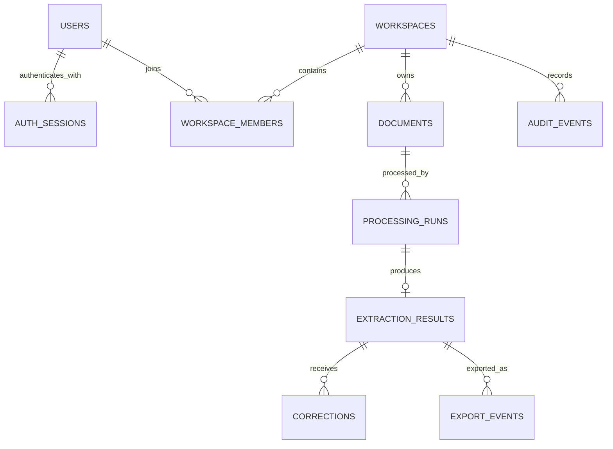
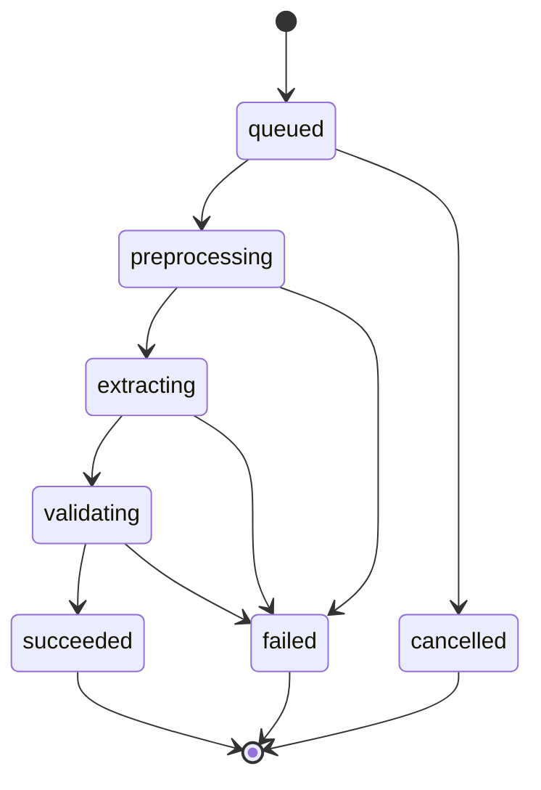
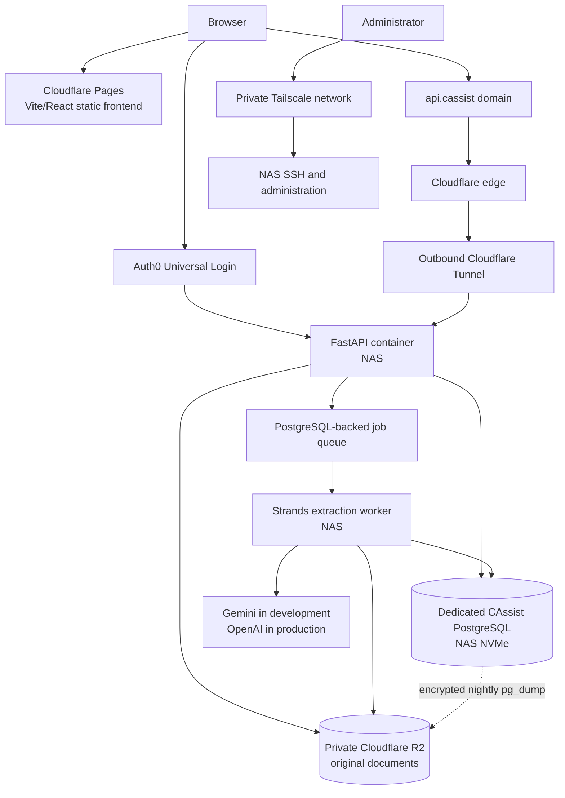

# CAssist: Application Architecture and API Contract

Status: architecture baseline  
API prefix: `/api/v1`  
Frontend: Vite + React + JavaScript + shadcn/ui  
Backend: FastAPI + PostgreSQL + Strands Agents  
Object storage: private Cloudflare R2  
Test model: `gemini-3.5-flash`  
Production model: `gpt-5.6-luna`

## 1. Locked boundaries

- There are no client, vendor, ledger, inventory, or Tally master tables.
- Original uploads remain in private R2 until the user deletes them.
- Derived page images and other preprocessing files are temporary.
- PostgreSQL stores file hashes, processing history, structured results, corrections, validations, and export events.
- ZIP files and direct Tally integration are outside the MVP.
- Production always uses OpenAI; Gemini selection and dual-model comparison are non-production features.
- Authentication uses Auth0 Universal Login through an Authlib-based OIDC adapter in FastAPI.
- CAssist never stores passwords or sends OIDC tokens to frontend JavaScript.
- Application sessions are opaque, revocable, and stored as hashes in PostgreSQL.
- HTTP access logs never include query strings because callbacks and signed URLs can contain secrets.

## 2. Entity relationships



## 3. PostgreSQL schema

The SQL below is the intended first migration. UUIDs are generated in PostgreSQL so API workers do not need a shared ID generator.

```sql
CREATE EXTENSION IF NOT EXISTS pgcrypto;

CREATE TYPE member_role AS ENUM ('owner', 'admin', 'member');
CREATE TYPE document_status AS ENUM (
    'upload_pending',
    'uploaded',
    'processing',
    'ready',
    'failed'
);
CREATE TYPE run_status AS ENUM (
    'queued',
    'preprocessing',
    'extracting',
    'validating',
    'succeeded',
    'failed',
    'cancelled'
);
CREATE TYPE review_status AS ENUM ('unreviewed', 'in_review', 'approved');
CREATE TYPE model_provider AS ENUM ('openai', 'gemini');
CREATE TYPE export_format AS ENUM ('json', 'csv', 'xlsx', 'tally_json');

CREATE TABLE users (
    id                  uuid PRIMARY KEY DEFAULT gen_random_uuid(),
    external_auth_id    text NOT NULL UNIQUE,
    email               text NOT NULL,
    display_name        text,
    created_at          timestamptz NOT NULL DEFAULT now(),
    last_seen_at        timestamptz
);

CREATE UNIQUE INDEX users_email_lower_idx ON users (lower(email));

CREATE TABLE workspaces (
    id                  uuid PRIMARY KEY DEFAULT gen_random_uuid(),
    name                text NOT NULL,
    created_by_user_id  uuid NOT NULL REFERENCES users(id),
    created_at          timestamptz NOT NULL DEFAULT now()
);

CREATE TABLE workspace_members (
    workspace_id        uuid NOT NULL REFERENCES workspaces(id) ON DELETE CASCADE,
    user_id             uuid NOT NULL REFERENCES users(id) ON DELETE CASCADE,
    role                member_role NOT NULL DEFAULT 'member',
    created_at          timestamptz NOT NULL DEFAULT now(),
    PRIMARY KEY (workspace_id, user_id)
);

CREATE TABLE documents (
    id                      uuid PRIMARY KEY DEFAULT gen_random_uuid(),
    workspace_id            uuid NOT NULL REFERENCES workspaces(id) ON DELETE CASCADE,
    uploaded_by_user_id     uuid NOT NULL REFERENCES users(id),
    original_filename       text NOT NULL,
    mime_type               text NOT NULL,
    byte_size               bigint NOT NULL CHECK (byte_size > 0),
    page_count              integer CHECK (page_count IS NULL OR page_count > 0),
    sha256                  char(64),
    r2_object_key           text,
    status                  document_status NOT NULL DEFAULT 'upload_pending',
    upload_expires_at       timestamptz,
    original_deleted_at     timestamptz,
    original_deleted_by    uuid REFERENCES users(id),
    created_at              timestamptz NOT NULL DEFAULT now(),
    updated_at              timestamptz NOT NULL DEFAULT now(),
    CHECK (
        (original_deleted_at IS NULL)
        OR (r2_object_key IS NULL AND original_deleted_by IS NOT NULL)
    )
);

-- Deduplicate only inside a workspace. Null hashes represent unfinished uploads.
CREATE UNIQUE INDEX documents_workspace_sha256_idx
    ON documents (workspace_id, sha256)
    WHERE sha256 IS NOT NULL;

CREATE INDEX documents_workspace_created_idx
    ON documents (workspace_id, created_at DESC);

CREATE TABLE processing_runs (
    id                      uuid PRIMARY KEY DEFAULT gen_random_uuid(),
    document_id             uuid NOT NULL REFERENCES documents(id) ON DELETE CASCADE,
    requested_by_user_id    uuid NOT NULL REFERENCES users(id),
    provider                model_provider NOT NULL,
    model_id                text NOT NULL,
    prompt_version          text NOT NULL,
    schema_version          text NOT NULL,
    preprocessing_version   text NOT NULL,
    status                  run_status NOT NULL DEFAULT 'queued',
    attempt_count           integer NOT NULL DEFAULT 0 CHECK (attempt_count >= 0),
    input_tokens            integer CHECK (input_tokens IS NULL OR input_tokens >= 0),
    output_tokens           integer CHECK (output_tokens IS NULL OR output_tokens >= 0),
    estimated_cost_usd      numeric(12, 6) CHECK (
                                estimated_cost_usd IS NULL OR estimated_cost_usd >= 0
                            ),
    error_code              text,
    error_message_safe      text,
    worker_id               text,
    lease_expires_at        timestamptz,
    queued_at               timestamptz NOT NULL DEFAULT now(),
    started_at              timestamptz,
    completed_at            timestamptz,
    created_at              timestamptz NOT NULL DEFAULT now()
);

-- A configuration can have many failed attempts, but only one successful cache entry.
CREATE UNIQUE INDEX processing_runs_success_cache_idx
    ON processing_runs (
        document_id,
        provider,
        model_id,
        prompt_version,
        schema_version,
        preprocessing_version
    )
    WHERE status = 'succeeded';

CREATE INDEX processing_runs_queue_idx
    ON processing_runs (queued_at)
    WHERE status = 'queued';

CREATE INDEX processing_runs_reclaim_idx
    ON processing_runs (lease_expires_at)
    WHERE status IN ('preprocessing', 'extracting', 'validating');

CREATE TABLE extraction_results (
    id                      uuid PRIMARY KEY DEFAULT gen_random_uuid(),
    processing_run_id       uuid NOT NULL UNIQUE
                                REFERENCES processing_runs(id) ON DELETE CASCADE,
    document_type           text NOT NULL,
    raw_provider_output     jsonb NOT NULL,
    canonical_data          jsonb NOT NULL,
    validation_issues       jsonb NOT NULL DEFAULT '[]'::jsonb,
    review_status           review_status NOT NULL DEFAULT 'unreviewed',
    version                 integer NOT NULL DEFAULT 1,
    reviewed_by_user_id     uuid REFERENCES users(id),
    reviewed_at             timestamptz,
    created_at              timestamptz NOT NULL DEFAULT now(),
    updated_at              timestamptz NOT NULL DEFAULT now()
);

CREATE INDEX extraction_results_document_type_idx
    ON extraction_results (document_type);

CREATE INDEX extraction_results_canonical_gin_idx
    ON extraction_results USING gin (canonical_data);

CREATE TABLE corrections (
    id                      uuid PRIMARY KEY DEFAULT gen_random_uuid(),
    extraction_result_id    uuid NOT NULL
                                REFERENCES extraction_results(id) ON DELETE CASCADE,
    corrected_by_user_id    uuid NOT NULL REFERENCES users(id),
    field_path              text NOT NULL,
    previous_value          jsonb,
    corrected_value         jsonb,
    reason                  text,
    created_at              timestamptz NOT NULL DEFAULT now()
);

CREATE INDEX corrections_result_created_idx
    ON corrections (extraction_result_id, created_at);

CREATE TABLE export_events (
    id                      uuid PRIMARY KEY DEFAULT gen_random_uuid(),
    extraction_result_id    uuid NOT NULL
                                REFERENCES extraction_results(id) ON DELETE CASCADE,
    exported_by_user_id     uuid NOT NULL REFERENCES users(id),
    format                  export_format NOT NULL,
    exporter_version        text NOT NULL,
    options                 jsonb NOT NULL DEFAULT '{}'::jsonb,
    created_at              timestamptz NOT NULL DEFAULT now()
);

-- Export files are generated on demand and are not retained as R2 objects.
CREATE INDEX export_events_result_created_idx
    ON export_events (extraction_result_id, created_at DESC);

CREATE TABLE audit_events (
    id                      bigserial PRIMARY KEY,
    workspace_id            uuid NOT NULL REFERENCES workspaces(id) ON DELETE CASCADE,
    actor_user_id           uuid REFERENCES users(id) ON DELETE SET NULL,
    action                  text NOT NULL,
    entity_type             text NOT NULL,
    entity_id               uuid,
    metadata                jsonb NOT NULL DEFAULT '{}'::jsonb,
    created_at              timestamptz NOT NULL DEFAULT now()
);

CREATE INDEX audit_events_workspace_created_idx
    ON audit_events (workspace_id, created_at DESC);
```

### Authentication session migration

Authentication is added after the initial application schema as a separate migration:

```sql
CREATE TABLE auth_sessions (
    id                  uuid PRIMARY KEY DEFAULT gen_random_uuid(),
    user_id             uuid NOT NULL REFERENCES users(id) ON DELETE CASCADE,
    token_hash          char(64) NOT NULL UNIQUE,
    csrf_token_hash     char(64) NOT NULL,
    created_at          timestamptz NOT NULL DEFAULT now(),
    last_seen_at        timestamptz NOT NULL DEFAULT now(),
    idle_expires_at     timestamptz NOT NULL,
    absolute_expires_at timestamptz NOT NULL,
    revoked_at          timestamptz,
    CHECK (idle_expires_at <= absolute_expires_at)
);

CREATE INDEX auth_sessions_user_active_idx
    ON auth_sessions (user_id, absolute_expires_at)
    WHERE revoked_at IS NULL;
```

Only SHA-256 hashes of the opaque session and CSRF tokens are stored. The raw session token exists
only in the HttpOnly API cookie. The raw CSRF token exists only in frontend memory and its request
header. Deleting a user cascades their application sessions.

### Storage invariants

1. `r2_object_key` is an opaque generated key and never contains a filename, client name, GSTIN, PAN, invoice number, or email address.
2. `sha256` is computed by trusted backend code from the uploaded object; a browser-provided hash is
   never trusted. For the 25 MiB MVP limit, the completion service computes it while finalizing the
   original so synchronous workspace deduplication can return the existing document ID.
3. Only one successful processing run exists for an identical cache configuration.
4. Corrections are append-only. The effective reviewed document is `canonical_data` plus corrections in creation order.
5. Audit metadata must never contain document text, extracted financial values, hashes, or provider responses.

## 4. Authentication and authorization

### Locked authentication approach

- Auth0 Universal Login is the initial identity provider.
- FastAPI is the confidential OIDC client and uses Authlib behind an `IdentityProvider` adapter.
- Use Authorization Code flow with PKCE (`S256`), `state`, and `nonce` validation.
- Request only `openid profile email`. A login is accepted only when the ID token is valid and
  `email_verified` is true.
- `external_auth_id` is derived from the verified issuer and subject claims. Email addresses are
  profile data and are never used as the authentication key or for automatic account linking.
- Provider credentials, the OIDC state-cookie signing secret, and callback URLs come only from
  environment variables or deployment secrets.
- Production has no development login, header-based identity override, or authentication bypass.

The provider adapter owns discovery, authorization redirects, callback exchange, ID-token validation,
and provider logout URL construction. Route dependencies consume only a provider-neutral verified
identity containing issuer, subject, verified email, and optional display name.

### Backend-owned session

After a successful callback, FastAPI upserts the local user and creates an opaque 256-bit application
session. On a user's first login, it also creates a private workspace and an `owner` membership in the
same database transaction. A duplicate verified email belonging to a different external identity is
rejected for explicit account-linking review; accounts are never merged automatically.

The raw session token is sent only in a host-only `HttpOnly`, `Secure`, `SameSite=Lax`, `Path=/`
cookie. Production uses a `__Host-` cookie name. The API stores only its SHA-256 hash and resolves the
user from PostgreSQL on every authenticated request. Auth0 access and ID tokens are discarded after
the callback and are never stored in local storage, session storage, application logs, or PostgreSQL.

- Default idle lifetime: 8 hours.
- Default absolute lifetime: 7 days.
- `last_seen_at` updates are throttled to at most once every five minutes.
- Logout revokes the database session before clearing cookies and initiating Auth0 logout.
- Session rotation creates a new opaque token and revokes the previous session atomically after
  reauthentication or a security-sensitive identity or privilege change.
- Expired and revoked rows may be deleted by a periodic PostgreSQL-backed maintenance job.

### CSRF and browser boundary

Unsafe cookie-authenticated requests (`POST`, `PUT`, `PATCH`, and `DELETE`) must pass both checks:

1. `Origin` matches the exact configured frontend origin.
2. `X-CSRF-Token` matches the stored SHA-256 hash using a constant-time comparison.

The CSRF token is independently random and contains no session or user data. Authenticated React
clients obtain a freshly rotated token from `GET /api/v1/auth/csrf`; the response is never cached and
the token is held only in memory. The bootstrap request itself must carry the exact configured
frontend `Origin`. This synchronizer-token design is required because a host-only API cookie cannot
be read by the static frontend on a sibling hostname. CORS allows credentials only from explicit
development and production frontend origins. Login `return_to` values must be relative application
paths; external redirect targets are rejected.

### Authorization

Authentication establishes the local user only. Authorization remains application-owned:

1. Every workspace and document query filters through `workspace_members` for the current user.
2. The server ignores client-supplied user IDs and roles.
3. Owner/admin-only actions check the current database role at request time.
4. Auth0 roles, organizations, email domains, and frontend route guards are not authorization sources.
5. Frontend guards improve navigation only; FastAPI enforces every permission.

### Authentication endpoints

#### `GET /api/v1/auth/login`

Starts OIDC login. Optional `return_to` must be a relative frontend path.

#### `GET /api/v1/auth/callback`

Validates the OIDC response, creates the local user/workspace/session transaction, sets the session
cookie, and redirects to the validated frontend path.

#### `GET /api/v1/auth/csrf`

Requires an authenticated session, rotates its CSRF token, and returns the raw token with
`Cache-Control: no-store`. This is the only endpoint that returns a CSRF token.

#### `GET /api/v1/auth/me`

Returns the current local user and workspace memberships. It never returns provider tokens or session
hashes.

```json
{
  "user": {
    "id": "a7cfa4fe-3f67-4b31-bd62-f31cfbaedb65",
    "email": "user@example.com",
    "display_name": "Example User"
  },
  "workspaces": [
    {
      "id": "833a84a7-f906-4223-9506-b7c3c02d545d",
      "name": "My workspace",
      "role": "owner"
    }
  ]
}
```

#### `POST /api/v1/auth/logout`

Requires CSRF validation, revokes the application session, clears the session cookie, and returns the
allowlisted Auth0 logout URL for browser navigation.

## 5. Deletion semantics

### Delete original only

`DELETE /api/v1/documents/{document_id}/original`

1. Authorize workspace membership.
2. Delete the object from R2.
3. Set `r2_object_key = NULL`, `original_deleted_at`, and `original_deleted_by` in one database transaction after R2 confirms deletion.
4. Retain the hash, extraction, corrections, and export-event history.
5. Add `document.original_deleted` to `audit_events`.

The document remains usable for copying and exporting extracted information, but it cannot be visually reviewed again.

### Permanently delete the record

`DELETE /api/v1/documents/{document_id}`

1. Authorize an owner/admin or the uploader according to the final authorization policy.
2. Delete the R2 object if it still exists.
3. Insert a content-free `document.permanently_deleted` audit event.
4. Hard-delete the document row; dependent runs, results, corrections, and export events cascade.
5. Do not retain the SHA-256, filename, extracted values, or provider output.

The deletion operation is idempotent. A repeated deletion returns `204 No Content`.

## 6. REST conventions

- Requests and responses use JSON except upload/download bodies.
- Dates use ISO 8601 UTC timestamps.
- Monetary canonical values are decimal strings, never JSON floating-point numbers.
- List endpoints use cursor pagination.
- Every mutation accepts an `Idempotency-Key` header.
- Errors use the same envelope:

```json
{
  "error": {
    "code": "DOCUMENT_NOT_READY",
    "message": "The document upload has not completed.",
    "request_id": "req_01J...",
    "details": {}
  }
}
```

### Logging boundary

Uvicorn access logs retain the client address, HTTP method, path, protocol, and status code but remove
the entire query string before formatting. This applies globally, not only to authentication routes,
because OAuth callbacks and future signed URLs can both carry temporary credentials. Application
logs must not contain authorization codes, OIDC state, session or CSRF tokens, signed URLs, document
contents, extracted financial values, hashes, or provider output.

## 7. Upload and document endpoints

### `POST /api/v1/uploads`

Creates a pending document and a short-lived presigned R2 upload URL.

The MVP accepts PDF, JPEG, and PNG originals up to 25 MiB. The authenticated user's private
workspace is selected server-side. The presigned upload targets `incoming/<random 128-bit value>`
and never contains the original filename or identity data. It expires after five minutes and signs
the exact `Content-Type`. The incoming key is not the permanent original key, so reusing an unexpired
presigned `PUT` cannot overwrite a completed document.
The private development bucket CORS policy allows only `http://localhost:5173` to use `PUT`, `GET`,
and `HEAD`, allows the `Content-Type` request header, exposes only `ETag`, and caches preflights for
one hour. Production replaces the development origin with the exact Cloudflare Pages origin.

Request:

```json
{
  "filename": "invoice-1042.pdf",
  "mime_type": "application/pdf",
  "byte_size": 483921
}
```

Response `201`:

```json
{
  "document_id": "1e594754-2f6c-4ef8-a24c-36980981b511",
  "upload": {
    "method": "PUT",
    "url": "https://presigned-upload-url",
    "headers": {
      "Content-Type": "application/pdf"
    },
    "expires_at": "2026-08-11T12:05:00Z"
  }
}
```

### `POST /api/v1/uploads/{document_id}/complete`

Confirms upload completion, verifies and finalizes the original, and queues processing.

The trusted completion service streams the private incoming object into a bounded temporary buffer,
checks the stored and streamed sizes against the database and 25 MiB limit, checks the stored
`Content-Type`, validates the PDF/JPEG/PNG file signature, and computes SHA-256. It then writes those
verified bytes to a new `originals/<random 128-bit value>` key that was never exposed to the browser.
Temporary data is closed and deleted after the request.

For a new hash, the document hash, permanent key, `uploaded` status, and configured queued processing
run are committed atomically in PostgreSQL. The incoming object is deleted after commit. Completion
is idempotent and does not create another run for an already completed document. Workspace
completion is serialized while checking the unique hash so concurrent identical uploads cannot both
become permanent documents. If the matching document's original was previously deleted, the new
verified upload restores its private original while retaining the existing document and processing
history.

Response `202`:

```json
{
  "document_id": "1e594754-2f6c-4ef8-a24c-36980981b511",
  "status": "uploaded"
}
```

If the verified hash already exists in the workspace, the backend deletes the duplicate R2 object and returns the existing document ID:

```json
{
  "document_id": "existing-document-id",
  "status": "ready",
  "deduplicated": true
}
```

### `GET /api/v1/documents`

Query parameters:

```text
status=ready
document_type=tax_invoice
cursor=opaque_cursor
limit=25
```

### `GET /api/v1/documents/{document_id}`

Returns metadata, latest successful run, review status, and whether the original is available. It never returns an R2 key or provider credentials.

### `POST /api/v1/documents/{document_id}/view-url`

Returns a short-lived presigned GET URL for the private original. Suggested expiry: five minutes.

### `DELETE /api/v1/documents/{document_id}/original`

Deletes only the R2 original. Response: `204`.

### `DELETE /api/v1/documents/{document_id}`

Permanently deletes the complete record. Response: `204`.

## 8. Processing endpoints

### `POST /api/v1/documents/{document_id}/runs`

Request in development:

```json
{
  "provider": "gemini",
  "model_id": "gemini-3.5-flash",
  "force": false
}
```

Production accepts no provider override:

```json
{
  "force": false
}
```

The server injects `openai` and `gpt-5.6-luna`. A production request containing a provider or model override returns `403 PROVIDER_OVERRIDE_DISABLED`.

Response `202` for a new run:

```json
{
  "run_id": "56168db1-4ef1-4d56-9572-7f9ea26bf01e",
  "status": "queued",
  "cache_hit": false
}
```

Response `200` for a cache hit:

```json
{
  "run_id": "existing-successful-run-id",
  "status": "succeeded",
  "cache_hit": true
}
```

### `GET /api/v1/runs/{run_id}`

Response:

```json
{
  "id": "56168db1-4ef1-4d56-9572-7f9ea26bf01e",
  "document_id": "1e594754-2f6c-4ef8-a24c-36980981b511",
  "provider": "gemini",
  "model_id": "gemini-3.5-flash",
  "status": "extracting",
  "progress": {
    "stage": "extracting",
    "completed_pages": 2,
    "total_pages": 4
  },
  "error": null
}
```

### `POST /api/v1/runs/{run_id}/cancel`

Best-effort cancellation for queued or active work. Response: `202`.

## 9. Extraction and review endpoints

### `GET /api/v1/runs/{run_id}/result`

Returns the raw canonical data, validation issues, corrections, and effective corrected data. The raw provider output is excluded from ordinary frontend responses.

```json
{
  "result_id": "e3951e79-d334-46fb-91ed-56c42ff619bb",
  "document_type": "tax_invoice",
  "version": 1,
  "review_status": "unreviewed",
  "canonical_data": {},
  "effective_data": {},
  "validation_issues": [],
  "corrections": []
}
```

### `PATCH /api/v1/results/{result_id}/fields`

Appends one or more field corrections.

```json
{
  "expected_version": 1,
  "changes": [
    {
      "field_path": "/document/number",
      "value": "INV-1042",
      "reason": "OCR omitted the final digit"
    }
  ]
}
```

Use JSON Pointer paths. The backend validates corrected values against the canonical Pydantic schema and reruns deterministic validators.
Corrections never replace `canonical_data`: each accepted field change appends a `corrections` row
with its previous value, corrected value, actor, reason, and timestamp. The effective document is
rebuilt by applying those rows in creation order. A correction moves the result to `in_review`,
including when it was previously approved, and clears the prior approval identity and timestamp.
The updated validation warnings are persisted on the result in the same transaction.

`expected_version` provides optimistic concurrency for correction and review mutations. Each
successful mutation increments the result version. A stale version returns `409` so two tabs cannot
silently submit against different effective documents. Audit events contain only action, actor,
result/workspace identifiers, version, counts, and status; correction values and document data are
never copied into audit metadata.

### `POST /api/v1/results/{result_id}/review`

```json
{
  "expected_version": 2,
  "status": "approved"
}
```

Only `in_review` and `approved` are accepted from clients. The server manages the initial `unreviewed` status.

## 10. Export endpoints

### `POST /api/v1/results/{result_id}/exports`

```json
{
  "expected_version": 3,
  "format": "tally_json",
  "options": {
    "include_validation_warnings": true
  }
}
```

The current implementation requires an approved result and the current optimistic-concurrency
version. It streams the generated file with `Cache-Control: no-store`, appends an `export_events`
row, and records a value-free audit event. Export artifacts are not retained in R2.

Implemented now:

- `tally_json` — CAssist Tally-oriented handoff JSON

The TallyPrime 7.0 native JSON format can directly create vouchers, but it requires the target
company and existing voucher, party-ledger, accounting-ledger or stock-item, and unit masters. The
official format also requires Tally-specific request variables such as `svCurrentCompany` and
`svVchImportFormat`. CAssist has no client/company or ledger/inventory masters in the MVP, so this
export deliberately sets `native_import_ready` to `false` and lists the unresolved mappings instead
of inventing them. It preserves the approved canonical decimal strings, converts an ISO invoice date
to Tally's `YYYYMMDD` form, and provides Purchase/Sales as unresolved candidate voucher types. Direct
native import is a later milestone after explicit company and master mapping exists. Official source:
https://help.tallysolutions.com/tally-prime-integration-using-json-1/

Reserved for later:

- `json`
- `csv`
- `xlsx`

## 11. Development-only comparison endpoint

### `POST /api/v1/documents/{document_id}/comparisons`

Runs the configured Gemini and OpenAI models using the same schema and preprocessing version.

```json
{
  "providers": [
    {"provider": "gemini", "model_id": "gemini-3.5-flash"},
    {"provider": "openai", "model_id": "gpt-5.6-luna"}
  ]
}
```

The route does not exist in production. Comparison results report field agreement, validation failures, latency, token use, estimated cost, and later human corrections. It does not choose a winner automatically.

## 12. Worker state machine



The worker claims jobs using `SELECT ... FOR UPDATE SKIP LOCKED`. A crashed job may be reclaimed after
a configured lease expires. Preprocessing rechecks the permanent object's size, type, and trusted
SHA-256, enforces page-count plus per-page and aggregate pixel limits, renders PDF pages to PNG with
PDFium, normalizes JPEG/PNG input with Pillow, and deletes its opaque temporary directory at the end
of the attempt. Provider calls require bounded timeouts and retry only rate limits, transient network
failures, and provider 5xx responses. Schema-validation failures should trigger at most one repair
attempt before failing visibly. Provider timeouts and retries must fit inside the PostgreSQL lease;
the configuration validator reserves a 30-second persistence margin and disables Strands' second
retry layer.

The extraction adapter is implemented behind one provider-neutral protocol. Development and test
may use Strands `GeminiModel` with the verified Google AI Studio model identifier
`gemini-3.5-flash`. Production is locked to Strands `OpenAIResponsesModel`, with stateless Responses
API calls to the verified model identifier `gpt-5.6-luna`; production cannot select Gemini or supply
a provider/model override. Page PNGs and extraction instructions are sent to the provider, while
credentials remain environment-only.

The first canonical schema covers Indian tax-invoice parties, line items, GST components, totals,
and source-page references. All monetary values, quantities, prices, discounts, and rates are strict
base-10 decimal strings. Provider output is parsed into the canonical Pydantic model, then
deterministic validators check required fields, dates, PAN/GSTIN shape, GSTIN checksum, line
arithmetic, GST components, and invoice totals with a two-paise tolerance. The canonical result,
provider response, token counts, and warning objects are persisted atomically before the document is
marked `ready`. A leased run can be reclaimed from any active stage and restarted safely.

## 13. Frontend route map

```text
/                         Dashboard and recent documents
/upload                   Upload dropzone and queued files
/documents/:documentId    Document metadata and processing history
/results/:resultId/review Side-by-side preview, fields, warnings, corrections
/settings                 Workspace and retention information
/dev/compare/:documentId  Non-production provider comparison
```

Suggested frontend data layer:

- React Router for routes.
- TanStack Query for server state and polling.
- React Hook Form for corrections.
- shadcn/ui for upload, table, dialog, tabs, form, badge, progress, and alert components.

## 14. MVP implementation order

1. Add OIDC authentication, PostgreSQL sessions, users, workspaces, and authorization dependencies.
2. Add document uploads, private R2 access, and deletion.
3. Add PostgreSQL job claiming and one PDF/image preprocessing path.
4. Add provider adapters, canonical invoice extraction, validation, and review corrections.
5. Add exports, history, audit events, and development-only provider comparison.

The first end-to-end slice is complete when one authenticated user can upload an invoice, receive a cached structured result, correct a field, download JSON, reopen the original through a five-minute signed URL, and permanently delete the entire record.

## 15. Development and deployment topology

### Locked rollout decision

- All development and testing take place on the developer Mac until the first usable version is ready.
- Nothing is installed, reconfigured, or exposed on the NAS during initial development.
- The first private deployment uses the existing NAS rather than a paid VPS.
- The application remains portable through containers and environment-based configuration so it can move to a VPS without an architectural rewrite.

### Initial deployment



### Component placement

| Component | Initial location | Rule |
|---|---|---|
| React frontend | Cloudflare Pages | Static production build; no application secrets |
| FastAPI API | NAS container | Reached only through Cloudflare Tunnel |
| Strands worker | NAS container | One worker initially; concurrency raised only after measurement |
| PostgreSQL | Dedicated NAS container on NVMe | Never published to the LAN or internet |
| Originals | Private Cloudflare R2 | Retained until user deletion |
| Temporary derivatives | Ephemeral worker storage | Deleted after processing |
| Database backups | Private R2 backup prefix | Encrypted before upload and kept separately from live database storage |

### Network and access boundaries

1. Public HTTP traffic reaches the API only through an outbound Cloudflare Tunnel. CAssist does not require router port forwarding.
2. SSH, Docker administration, PostgreSQL, metrics, and internal service ports are accessible only through the private Tailscale network or directly from the trusted LAN.
3. Tailscale administration remains restricted to the owner account. Existing family access to other self-hosted services does not grant access to CAssist services.
4. PostgreSQL and the worker have no public ports. Containers communicate over a dedicated private Compose network.
5. R2 buckets remain private. Browser upload, preview, and download access uses narrowly scoped, short-lived signed URLs.

### NAS operating envelope

The deployment target is the existing Debian 13 x86-64 NAS with a x86-64 processor, 16 GB RAM, NVMe system storage, Docker, and Docker Compose. It has sufficient capacity for the private pilot alongside the existing workloads.

- Start with one extraction worker and at most one active document-processing job.
- Apply CPU and memory limits to every CAssist container.
- Keep PostgreSQL data and container layers on the NVMe, not the media HDD.
- Preserve capacity for existing existing workloads.
- The NAS is protected by an existing UPS; graceful shutdown integration and recovery behavior must be verified before public production.

### Recovery and portability

1. Create an encrypted logical PostgreSQL backup every night and upload it to R2.
2. Retain a documented rotation of daily and weekly backups; finalize exact retention before the private pilot.
3. Test restoration into a clean PostgreSQL container before inviting external users.
4. Keep production Compose files, migrations, health checks, and configuration documentation in this repository.
5. Treat the NAS as replaceable compute: a clean VPS must be able to run the same images using restored database data and the existing R2 objects.

### Promotion gate

The NAS deployment may serve demonstrations and a small invitation-only pilot after the tunnel, access controls, container limits, monitoring, backup, and restore test are complete. A move to a datacenter VPS is reconsidered when measured load, availability requirements, residential connectivity, or user count exceeds the NAS operating envelope.
