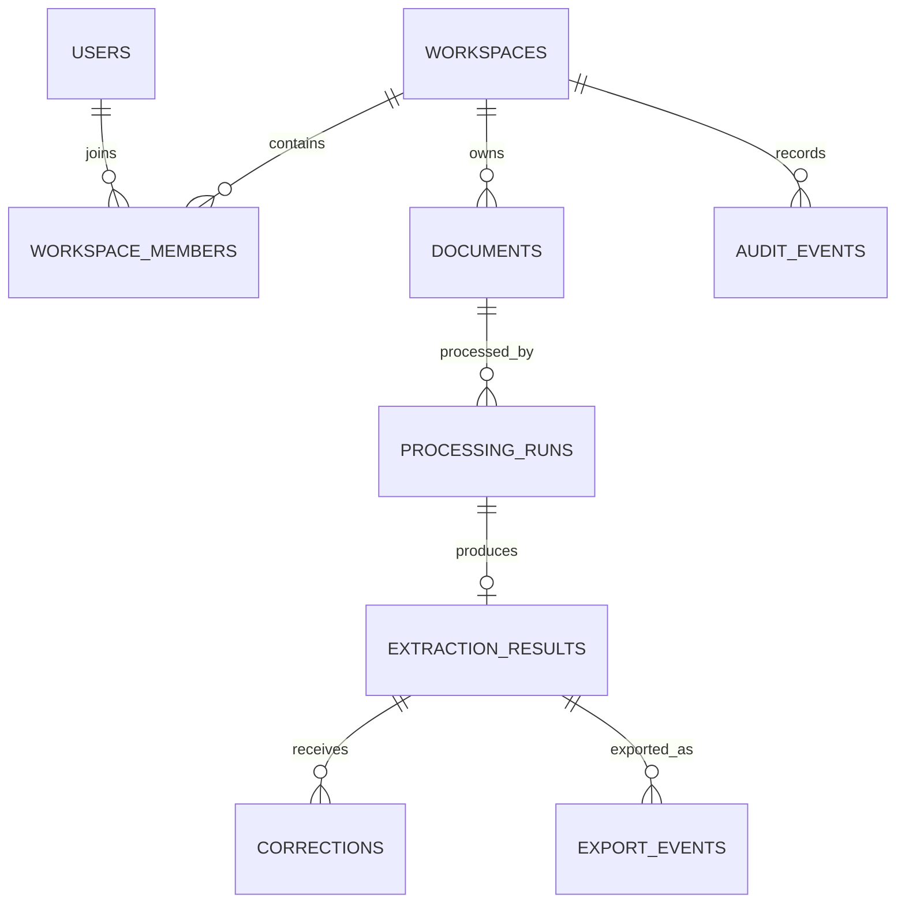
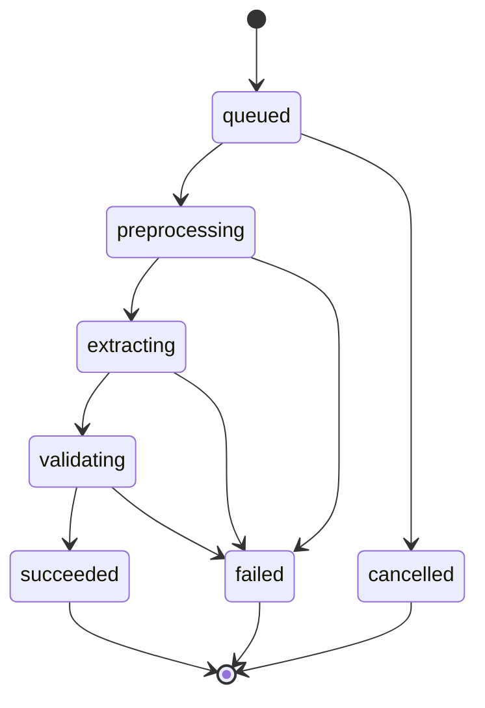
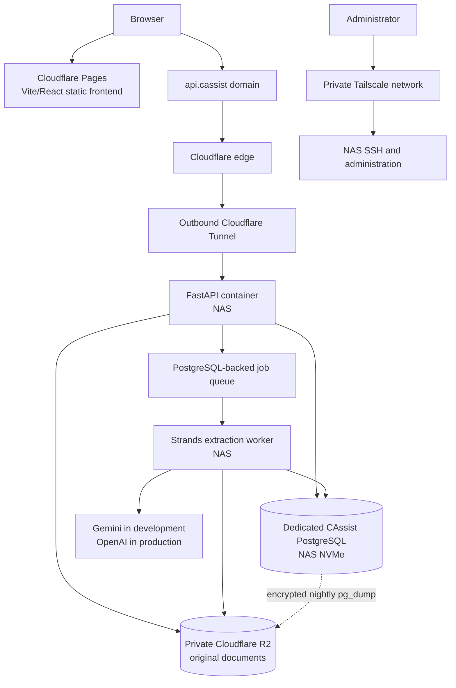

# CAssist: Application Architecture and API Contract

Status: architecture baseline  
API prefix: `/api/v1`  
Frontend: Vite + React + JavaScript + shadcn/ui  
Backend: FastAPI + PostgreSQL + Strands Agents  
Object storage: private Cloudflare R2  
Test model: `gemini-3.5-flash`  
Production model: `gpt-5.6-luna`

## 1. Locked boundaries

- There are no client, vendor, ledger, inventory, or Tally master tables.
- Original uploads remain in private R2 until the user deletes them.
- Derived page images and other preprocessing files are temporary.
- PostgreSQL stores file hashes, processing history, structured results, corrections, validations, and export events.
- ZIP files and direct Tally integration are outside the MVP.
- Production always uses OpenAI; Gemini selection and dual-model comparison are non-production features.

## 2. Entity relationships



## 3. PostgreSQL schema

The SQL below is the intended first migration. UUIDs are generated in PostgreSQL so API workers do not need a shared ID generator.

```sql
CREATE EXTENSION IF NOT EXISTS pgcrypto;

CREATE TYPE member_role AS ENUM ('owner', 'admin', 'member');
CREATE TYPE document_status AS ENUM (
    'upload_pending',
    'uploaded',
    'processing',
    'ready',
    'failed'
);
CREATE TYPE run_status AS ENUM (
    'queued',
    'preprocessing',
    'extracting',
    'validating',
    'succeeded',
    'failed',
    'cancelled'
);
CREATE TYPE review_status AS ENUM ('unreviewed', 'in_review', 'approved');
CREATE TYPE model_provider AS ENUM ('openai', 'gemini');
CREATE TYPE export_format AS ENUM ('json', 'csv', 'xlsx', 'tally_json');

CREATE TABLE users (
    id                  uuid PRIMARY KEY DEFAULT gen_random_uuid(),
    external_auth_id    text NOT NULL UNIQUE,
    email               text NOT NULL,
    display_name        text,
    created_at          timestamptz NOT NULL DEFAULT now(),
    last_seen_at        timestamptz
);

CREATE UNIQUE INDEX users_email_lower_idx ON users (lower(email));

CREATE TABLE workspaces (
    id                  uuid PRIMARY KEY DEFAULT gen_random_uuid(),
    name                text NOT NULL,
    created_by_user_id  uuid NOT NULL REFERENCES users(id),
    created_at          timestamptz NOT NULL DEFAULT now()
);

CREATE TABLE workspace_members (
    workspace_id        uuid NOT NULL REFERENCES workspaces(id) ON DELETE CASCADE,
    user_id             uuid NOT NULL REFERENCES users(id) ON DELETE CASCADE,
    role                member_role NOT NULL DEFAULT 'member',
    created_at          timestamptz NOT NULL DEFAULT now(),
    PRIMARY KEY (workspace_id, user_id)
);

CREATE TABLE documents (
    id                      uuid PRIMARY KEY DEFAULT gen_random_uuid(),
    workspace_id            uuid NOT NULL REFERENCES workspaces(id) ON DELETE CASCADE,
    uploaded_by_user_id     uuid NOT NULL REFERENCES users(id),
    original_filename       text NOT NULL,
    mime_type               text NOT NULL,
    byte_size               bigint NOT NULL CHECK (byte_size > 0),
    page_count              integer CHECK (page_count IS NULL OR page_count > 0),
    sha256                  char(64),
    r2_object_key           text,
    status                  document_status NOT NULL DEFAULT 'upload_pending',
    upload_expires_at       timestamptz,
    original_deleted_at     timestamptz,
    original_deleted_by    uuid REFERENCES users(id),
    created_at              timestamptz NOT NULL DEFAULT now(),
    updated_at              timestamptz NOT NULL DEFAULT now(),
    CHECK (
        (original_deleted_at IS NULL)
        OR (r2_object_key IS NULL AND original_deleted_by IS NOT NULL)
    )
);

-- Deduplicate only inside a workspace. Null hashes represent unfinished uploads.
CREATE UNIQUE INDEX documents_workspace_sha256_idx
    ON documents (workspace_id, sha256)
    WHERE sha256 IS NOT NULL;

CREATE INDEX documents_workspace_created_idx
    ON documents (workspace_id, created_at DESC);

CREATE TABLE processing_runs (
    id                      uuid PRIMARY KEY DEFAULT gen_random_uuid(),
    document_id             uuid NOT NULL REFERENCES documents(id) ON DELETE CASCADE,
    requested_by_user_id    uuid NOT NULL REFERENCES users(id),
    provider                model_provider NOT NULL,
    model_id                text NOT NULL,
    prompt_version          text NOT NULL,
    schema_version          text NOT NULL,
    preprocessing_version   text NOT NULL,
    status                  run_status NOT NULL DEFAULT 'queued',
    attempt_count           integer NOT NULL DEFAULT 0 CHECK (attempt_count >= 0),
    input_tokens            integer CHECK (input_tokens IS NULL OR input_tokens >= 0),
    output_tokens           integer CHECK (output_tokens IS NULL OR output_tokens >= 0),
    estimated_cost_usd      numeric(12, 6) CHECK (
                                estimated_cost_usd IS NULL OR estimated_cost_usd >= 0
                            ),
    error_code              text,
    error_message_safe      text,
    queued_at               timestamptz NOT NULL DEFAULT now(),
    started_at              timestamptz,
    completed_at            timestamptz,
    created_at              timestamptz NOT NULL DEFAULT now()
);

-- A configuration can have many failed attempts, but only one successful cache entry.
CREATE UNIQUE INDEX processing_runs_success_cache_idx
    ON processing_runs (
        document_id,
        provider,
        model_id,
        prompt_version,
        schema_version,
        preprocessing_version
    )
    WHERE status = 'succeeded';

CREATE INDEX processing_runs_queue_idx
    ON processing_runs (queued_at)
    WHERE status = 'queued';

CREATE TABLE extraction_results (
    id                      uuid PRIMARY KEY DEFAULT gen_random_uuid(),
    processing_run_id       uuid NOT NULL UNIQUE
                                REFERENCES processing_runs(id) ON DELETE CASCADE,
    document_type           text NOT NULL,
    raw_provider_output     jsonb NOT NULL,
    canonical_data          jsonb NOT NULL,
    validation_issues       jsonb NOT NULL DEFAULT '[]'::jsonb,
    review_status           review_status NOT NULL DEFAULT 'unreviewed',
    reviewed_by_user_id     uuid REFERENCES users(id),
    reviewed_at             timestamptz,
    created_at              timestamptz NOT NULL DEFAULT now(),
    updated_at              timestamptz NOT NULL DEFAULT now()
);

CREATE INDEX extraction_results_document_type_idx
    ON extraction_results (document_type);

CREATE INDEX extraction_results_canonical_gin_idx
    ON extraction_results USING gin (canonical_data);

CREATE TABLE corrections (
    id                      uuid PRIMARY KEY DEFAULT gen_random_uuid(),
    extraction_result_id    uuid NOT NULL
                                REFERENCES extraction_results(id) ON DELETE CASCADE,
    corrected_by_user_id    uuid NOT NULL REFERENCES users(id),
    field_path              text NOT NULL,
    previous_value          jsonb,
    corrected_value         jsonb,
    reason                  text,
    created_at              timestamptz NOT NULL DEFAULT now()
);

CREATE INDEX corrections_result_created_idx
    ON corrections (extraction_result_id, created_at);

CREATE TABLE export_events (
    id                      uuid PRIMARY KEY DEFAULT gen_random_uuid(),
    extraction_result_id    uuid NOT NULL
                                REFERENCES extraction_results(id) ON DELETE CASCADE,
    exported_by_user_id     uuid NOT NULL REFERENCES users(id),
    format                  export_format NOT NULL,
    exporter_version        text NOT NULL,
    options                 jsonb NOT NULL DEFAULT '{}'::jsonb,
    created_at              timestamptz NOT NULL DEFAULT now()
);

-- Export files are generated on demand and are not retained as R2 objects.
CREATE INDEX export_events_result_created_idx
    ON export_events (extraction_result_id, created_at DESC);

CREATE TABLE audit_events (
    id                      bigserial PRIMARY KEY,
    workspace_id            uuid NOT NULL REFERENCES workspaces(id) ON DELETE CASCADE,
    actor_user_id           uuid REFERENCES users(id) ON DELETE SET NULL,
    action                  text NOT NULL,
    entity_type             text NOT NULL,
    entity_id               uuid,
    metadata                jsonb NOT NULL DEFAULT '{}'::jsonb,
    created_at              timestamptz NOT NULL DEFAULT now()
);

CREATE INDEX audit_events_workspace_created_idx
    ON audit_events (workspace_id, created_at DESC);
```

### Storage invariants

1. `r2_object_key` is an opaque generated key and never contains a filename, client name, GSTIN, PAN, invoice number, or email address.
2. `sha256` is computed by the worker from the uploaded object; a browser-provided hash is only a hint.
3. Only one successful processing run exists for an identical cache configuration.
4. Corrections are append-only. The effective reviewed document is `canonical_data` plus corrections in creation order.
5. Audit metadata must never contain document text, extracted financial values, hashes, or provider responses.

## 4. Deletion semantics

### Delete original only

`DELETE /api/v1/documents/{document_id}/original`

1. Authorize workspace membership.
2. Delete the object from R2.
3. Set `r2_object_key = NULL`, `original_deleted_at`, and `original_deleted_by` in one database transaction after R2 confirms deletion.
4. Retain the hash, extraction, corrections, and export-event history.
5. Add `document.original_deleted` to `audit_events`.

The document remains usable for copying and exporting extracted information, but it cannot be visually reviewed again.

### Permanently delete the record

`DELETE /api/v1/documents/{document_id}`

1. Authorize an owner/admin or the uploader according to the final authorization policy.
2. Delete the R2 object if it still exists.
3. Insert a content-free `document.permanently_deleted` audit event.
4. Hard-delete the document row; dependent runs, results, corrections, and export events cascade.
5. Do not retain the SHA-256, filename, extracted values, or provider output.

The deletion operation is idempotent. A repeated deletion returns `204 No Content`.

## 5. REST conventions

- Requests and responses use JSON except upload/download bodies.
- Dates use ISO 8601 UTC timestamps.
- Monetary canonical values are decimal strings, never JSON floating-point numbers.
- List endpoints use cursor pagination.
- Every mutation accepts an `Idempotency-Key` header.
- Errors use the same envelope:

```json
{
  "error": {
    "code": "DOCUMENT_NOT_READY",
    "message": "The document upload has not completed.",
    "request_id": "req_01J...",
    "details": {}
  }
}
```

## 6. Upload and document endpoints

### `POST /api/v1/uploads`

Creates a pending document and a short-lived presigned R2 upload URL.

Request:

```json
{
  "filename": "invoice-1042.pdf",
  "mime_type": "application/pdf",
  "byte_size": 483921
}
```

Response `201`:

```json
{
  "document_id": "1e594754-2f6c-4ef8-a24c-36980981b511",
  "upload": {
    "method": "PUT",
    "url": "https://presigned-upload-url",
    "headers": {
      "Content-Type": "application/pdf"
    },
    "expires_at": "2026-08-11T12:05:00Z"
  }
}
```

### `POST /api/v1/uploads/{document_id}/complete`

Confirms upload completion and queues file verification and hashing.

Response `202`:

```json
{
  "document_id": "1e594754-2f6c-4ef8-a24c-36980981b511",
  "status": "uploaded"
}
```

If the verified hash already exists in the workspace, the backend deletes the duplicate R2 object and returns the existing document ID:

```json
{
  "document_id": "existing-document-id",
  "status": "ready",
  "deduplicated": true
}
```

### `GET /api/v1/documents`

Query parameters:

```text
status=ready
document_type=tax_invoice
cursor=opaque_cursor
limit=25
```

### `GET /api/v1/documents/{document_id}`

Returns metadata, latest successful run, review status, and whether the original is available. It never returns an R2 key or provider credentials.

### `POST /api/v1/documents/{document_id}/view-url`

Returns a short-lived presigned GET URL for the private original. Suggested expiry: five minutes.

### `DELETE /api/v1/documents/{document_id}/original`

Deletes only the R2 original. Response: `204`.

### `DELETE /api/v1/documents/{document_id}`

Permanently deletes the complete record. Response: `204`.

## 7. Processing endpoints

### `POST /api/v1/documents/{document_id}/runs`

Request in development:

```json
{
  "provider": "gemini",
  "model_id": "gemini-3.5-flash",
  "force": false
}
```

Production accepts no provider override:

```json
{
  "force": false
}
```

The server injects `openai` and `gpt-5.6-luna`. A production request containing a provider or model override returns `403 PROVIDER_OVERRIDE_DISABLED`.

Response `202` for a new run:

```json
{
  "run_id": "56168db1-4ef1-4d56-9572-7f9ea26bf01e",
  "status": "queued",
  "cache_hit": false
}
```

Response `200` for a cache hit:

```json
{
  "run_id": "existing-successful-run-id",
  "status": "succeeded",
  "cache_hit": true
}
```

### `GET /api/v1/runs/{run_id}`

Response:

```json
{
  "id": "56168db1-4ef1-4d56-9572-7f9ea26bf01e",
  "document_id": "1e594754-2f6c-4ef8-a24c-36980981b511",
  "provider": "gemini",
  "model_id": "gemini-3.5-flash",
  "status": "extracting",
  "progress": {
    "stage": "extracting",
    "completed_pages": 2,
    "total_pages": 4
  },
  "error": null
}
```

### `POST /api/v1/runs/{run_id}/cancel`

Best-effort cancellation for queued or active work. Response: `202`.

## 8. Extraction and review endpoints

### `GET /api/v1/runs/{run_id}/result`

Returns the raw canonical data, validation issues, corrections, and effective corrected data. The raw provider output is excluded from ordinary frontend responses.

```json
{
  "result_id": "e3951e79-d334-46fb-91ed-56c42ff619bb",
  "document_type": "tax_invoice",
  "review_status": "unreviewed",
  "canonical_data": {},
  "effective_data": {},
  "validation_issues": [],
  "corrections": []
}
```

### `PATCH /api/v1/results/{result_id}/fields`

Appends one or more field corrections.

```json
{
  "changes": [
    {
      "field_path": "/document/number",
      "value": "INV-1042",
      "reason": "OCR omitted the final digit"
    }
  ]
}
```

Use JSON Pointer paths. The backend validates corrected values against the canonical Pydantic schema and reruns deterministic validators.

### `POST /api/v1/results/{result_id}/review`

```json
{
  "status": "approved"
}
```

Only `in_review` and `approved` are accepted from clients. The server manages the initial `unreviewed` status.

## 9. Export endpoints

### `POST /api/v1/results/{result_id}/exports`

```json
{
  "format": "xlsx",
  "options": {
    "include_evidence": false,
    "include_validation_warnings": true
  }
}
```

Response streams the generated file and adds an `export_events` row. Export artifacts are not retained in R2.

Supported now:

- `json`
- `csv`
- `xlsx`

Reserved for later:

- `tally_json`

## 10. Development-only comparison endpoint

### `POST /api/v1/documents/{document_id}/comparisons`

Runs the configured Gemini and OpenAI models using the same schema and preprocessing version.

```json
{
  "providers": [
    {"provider": "gemini", "model_id": "gemini-3.5-flash"},
    {"provider": "openai", "model_id": "gpt-5.6-luna"}
  ]
}
```

The route does not exist in production. Comparison results report field agreement, validation failures, latency, token use, estimated cost, and later human corrections. It does not choose a winner automatically.

## 11. Worker state machine



The worker claims jobs using `SELECT ... FOR UPDATE SKIP LOCKED`. A crashed job may be reclaimed after a configured lease expires. Provider calls require bounded timeouts and retry only rate limits, transient network failures, and provider 5xx responses. Schema-validation failures should trigger at most one repair attempt before failing visibly.

## 12. Frontend route map

```text
/                         Dashboard and recent documents
/upload                   Upload dropzone and queued files
/documents/:documentId    Document metadata and processing history
/results/:resultId/review Side-by-side preview, fields, warnings, corrections
/settings                 Workspace and retention information
/dev/compare/:documentId  Non-production provider comparison
```

Suggested frontend data layer:

- React Router for routes.
- TanStack Query for server state and polling.
- React Hook Form for corrections.
- shadcn/ui for upload, table, dialog, tabs, form, badge, progress, and alert components.

## 13. MVP implementation order

1. Create users, workspaces, document uploads, private R2 access, and deletion.
2. Add PostgreSQL job claiming and one PDF/image preprocessing path.
3. Add the provider adapter with Gemini development mode and OpenAI production lock.
4. Add canonical invoice extraction, deterministic validation, and review corrections.
5. Add JSON/CSV/XLSX exports, history, audit events, and provider comparison.

The first end-to-end slice is complete when one authenticated user can upload an invoice, receive a cached structured result, correct a field, download JSON, reopen the original through a five-minute signed URL, and permanently delete the entire record.

## 14. Development and deployment topology

### Locked rollout decision

- All development and testing take place on the developer Mac until the first usable version is ready.
- Nothing is installed, reconfigured, or exposed on the NAS during initial development.
- The first private deployment uses the existing NAS rather than a paid VPS.
- The application remains portable through containers and environment-based configuration so it can move to a VPS without an architectural rewrite.

### Initial deployment



### Component placement

| Component | Initial location | Rule |
|---|---|---|
| React frontend | Cloudflare Pages | Static production build; no application secrets |
| FastAPI API | NAS container | Reached only through Cloudflare Tunnel |
| Strands worker | NAS container | One worker initially; concurrency raised only after measurement |
| PostgreSQL | Dedicated NAS container on NVMe | Never published to the LAN or internet |
| Originals | Private Cloudflare R2 | Retained until user deletion |
| Temporary derivatives | Ephemeral worker storage | Deleted after processing |
| Database backups | Private R2 backup prefix | Encrypted before upload and kept separately from live database storage |

### Network and access boundaries

1. Public HTTP traffic reaches the API only through an outbound Cloudflare Tunnel. CAssist does not require router port forwarding.
2. SSH, Docker administration, PostgreSQL, metrics, and internal service ports are accessible only through the private Tailscale network or directly from the trusted LAN.
3. Tailscale administration remains restricted to the owner account. Existing family access to other self-hosted services does not grant access to CAssist services.
4. PostgreSQL and the worker have no public ports. Containers communicate over a dedicated private Compose network.
5. R2 buckets remain private. Browser upload, preview, and download access uses narrowly scoped, short-lived signed URLs.

### NAS operating envelope

The deployment target is the existing Debian 13 x86-64 NAS with a x86-64 processor, 16 GB RAM, NVMe system storage, Docker, and Docker Compose. It has sufficient capacity for the private pilot alongside the existing workloads.

- Start with one extraction worker and at most one active document-processing job.
- Apply CPU and memory limits to every CAssist container.
- Keep PostgreSQL data and container layers on the NVMe, not the media HDD.
- Preserve capacity for existing existing workloads.
- The NAS is protected by an existing UPS; graceful shutdown integration and recovery behavior must be verified before public production.

### Recovery and portability

1. Create an encrypted logical PostgreSQL backup every night and upload it to R2.
2. Retain a documented rotation of daily and weekly backups; finalize exact retention before the private pilot.
3. Test restoration into a clean PostgreSQL container before inviting external users.
4. Keep production Compose files, migrations, health checks, and configuration documentation in this repository.
5. Treat the NAS as replaceable compute: a clean VPS must be able to run the same images using restored database data and the existing R2 objects.

### Promotion gate

The NAS deployment may serve demonstrations and a small invitation-only pilot after the tunnel, access controls, container limits, monitoring, backup, and restore test are complete. A move to a datacenter VPS is reconsidered when measured load, availability requirements, residential connectivity, or user count exceeds the NAS operating envelope.
